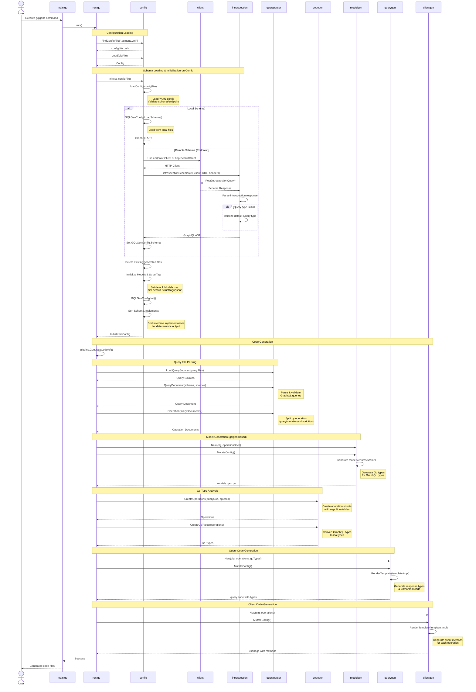

# gqlgenc

## What is gqlgenc ?

This is Go library for building GraphQL client with [gqlgen](https://github.com/99designs/gqlgen)

### Query First, not Code First

However, as I work with [gqlgen](https://github.com/99designs/gqlgen) and [graphql-code-generator](https://graphql-code-generator.com/) every day, I find out the beauty of automatic generation.
So I want to automatically generate types.

### based on gqlgen

- [Khan/genqlient](https://github.com/Khan/genqlient) is built from scratch as its own system. However, since gqlgenc is based on gqlgen, knowledge learned from either can be directly applied.

## Usage

```shell script
go get -tool github.com/Yamashou/gqlgenc/v3@latest
or
go install github.com/Yamashou/gqlgenc/v3@latest
```

## How to use

### Client Codes Only

```yaml
# schema for query
schema:
  - ""
endpoint:
  url: https://api.annict.com/graphql # Where do you want to send your request?
  headers: # If you need header for getting introspection query, set it
    Authorization: "Bearer ${ANNICT_KEY}" # support environment variables
# client to generate
client:
  package: generated
  filename: ./client.go # Where should any generated client go?
# query to generate
query:
  source: "./query/*.graphql" # Where are all the query files located?
  package: generated
  filename: ./client.go # Where should any generated client go?
# query to generate
model:
 package: generated
 filename: ./models_gen.go # https://github.com/99designs/gqlgen/tree/master/plugin/modelgen
models:
  Int:
    model: github.com/99designs/gqlgen/graphql.Int64
  Date:
    model: github.com/99designs/gqlgen/graphql.Time
federation: # Add this if your schema includes Apollo Federation related directives
  version: 2
# input model config
nullable_input_omittable: true
enable_model_json_omitzero: true
```

Load a schema from a local file:

```yaml
model:
  package: generated
  filename: ./models_gen.go # https://github.com/99designs/gqlgen/tree/master/plugin/modelgen
client:
  package: generated
  filename: ./client.go # Where should any generated client go?
models:
  Int:
    model: github.com/99designs/gqlgen/graphql.Int64
  Date:
    model: github.com/99designs/gqlgen/graphql.Time
federation: # Add this if your schema includes Apollo Federation related directives
  version: 2
schema:
  - "schema/**/*.graphql" # Where are all the schema files located?
query:
  - "./query/*.graphql" # Where are all the query files located?
generate:
  clientInterfaceName: "GithubGraphQLClient" # Determine the name of the generated client interface
```

Execute the following command on same directory for .gqlgenc.yml

```shell script
gqlgenc
```

or if you want to specify a different directory where .gqlgenc.yml file resides
(e.g. in this example the directory is *schemas*):

```shell script
gqlgenc generate --configdir schemas
```

### With gqlgen

Do this when creating a server and client for Go.
You create your own entrypoint for gqlgen.
This use case is very useful for testing your server.


```go
package main

import (
	"fmt"
	"os"

	"github.com/Yamashou/gqlgenc/v3/clientgen"

	"github.com/99designs/gqlgen/api"
	"github.com/99designs/gqlgen/codegen/config"
)

func main() {
	cfg, err := config.LoadConfigFromDefaultLocations()
	if err != nil {
		fmt.Fprintln(os.Stderr, "failed to load config", err.Error())
		os.Exit(2)
	}
	queries := []string{"client.query", "fragemt.query"}
	clientPackage := config.PackageConfig{
		Filename: "./client.go",
		Package:  "gen",
	}

	clientPlugin := clientgen.New(queries, clientPackage, nil)
	err = api.Generate(cfg,
		api.AddPlugin(clientPlugin),
	)
	if err != nil {
		fmt.Fprintln(os.Stderr, err.Error())
		os.Exit(3)
	}
}
```

## Code Generation Flow

The following sequence diagram illustrates the code generation flow of gqlgenc:



### Flow Description

1. **Configuration Loading**: Find and load `.gqlgenc.yml` configuration file
   - Validate that either `schema` or `endpoint` is specified (not both)
   - Parse YAML configuration with environment variable expansion

2. **Schema Loading & Initialization** (`config.Init()`):
   - **Local Schema Path**:
     - Load schema from local GraphQL files using glob patterns
   - **Remote Schema Path** (Endpoint):
     - Use custom HTTP client if provided (`endpoint.Client`), or default HTTP client
     - Execute GraphQL introspection query to fetch schema
     - Parse introspection response and build GraphQL AST
     - Initialize default Query type if schema.queryType is null
   - **Post-Schema Processing**:
     - Delete existing generated files to ensure clean generation
     - Initialize gqlgen config (Models map, StructTag default)
     - Execute `GQLGenConfig.Init()` to prepare schema
     - Sort interface implementations (`Schema.Implements`) for deterministic output

3. **Query Parsing**: Load and parse GraphQL query files, validate against schema

4. **Code Generation**:
   - **Model Generation**: Generate Go types for GraphQL scalars, enums, and input types
   - **Operation & Type Generation**: Convert GraphQL operations to Go operation structures and response types
   - **Query Generation**: Generate Go code for query/mutation response types
   - **Client Generation**: Generate client methods for executing queries/mutations

## VS

