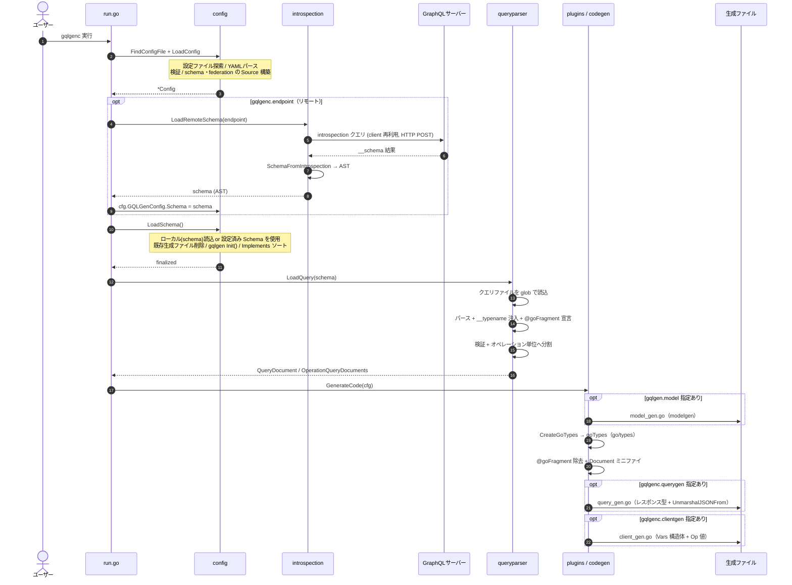
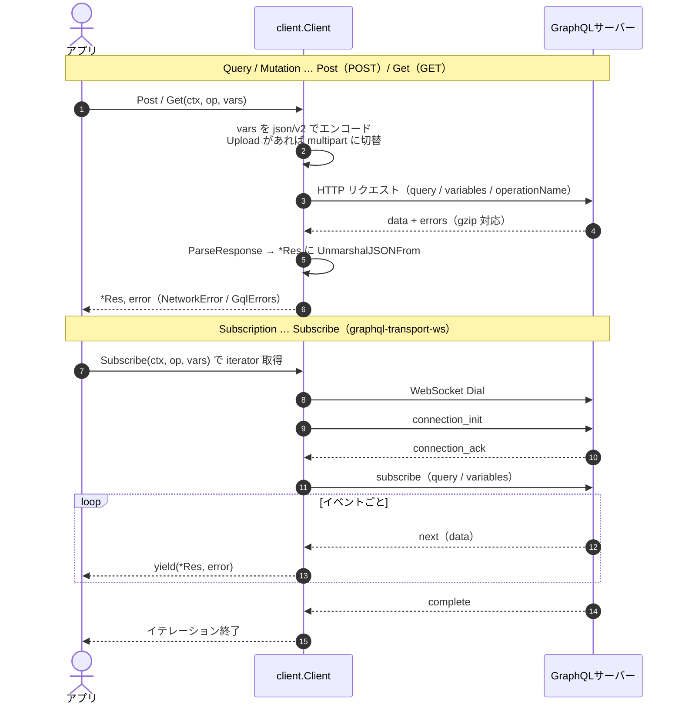

# gqlgenc

[gqlgen](https://github.com/99designs/gqlgen) をベースにした、Go 用 GraphQL クライアントのコードジェネレータおよびランタイムライブラリ。

## 概要

gqlgenc は、GraphQL スキーマとクエリ（オペレーション）から型安全な Go のクライアントコードを自動生成するツールです。コードを起点にする Code First ではなく、クエリを起点にコードを生成する Query First を採用しています。

- gqlgen ベース。モデル生成には gqlgen の modelgen プラグインをそのまま利用し、設定も gqlgen の形式を踏襲します
- 生成コードとランタイムは `encoding/json/v2` / `encoding/json/jsontext` を使用します

## v1 設計方針

- シンプルな生成コード
- シンプルな実装コード
- 最小のConfig、設定より規約
- モダンな言語機能の採用

## 動作要件

- Go 1.27 以上
- ビルド・テスト時に環境変数 `GOEXPERIMENT=jsonv2` の設定が必要です（`encoding/json/v2` を使用するため）

## インストール

```shell
go get -tool github.com/Yamashou/gqlgenc/v3@latest
# または
go install github.com/Yamashou/gqlgenc/v3@latest
```

## 使い方

### 1. 設定ファイルを書く

カレントディレクトリ（見つからない場合は親ディレクトリを順に遡る）の `.gqlgenc.yml` / `gqlgenc.yml` / `.gqlgenc.yaml` / `gqlgenc.yaml` を読み込みます。設定ファイルは `gqlgenc` と `gqlgen` の2セクションで構成されます。

ローカルのスキーマファイルから生成する例:

```yaml
gqlgenc:
  query:
    - ./query/*.graphql
  querygen:
    filename: ./domain/query_gen.go
  clientgen:
    filename: ./query/client_gen.go
gqlgen:
  schema:
    - ./schema/*.graphql
  model:
    filename: ./domain/model_gen.go
  enable_model_json_omitzero_tag: true
  nullable_input_omittable: true
  struct_fields_always_pointers: false
  autobind:
    - github.com/example/myapp/domain
  models:
    Email:
      model: github.com/example/myapp/domain.Email
```

リモートサーバーからイントロスペクションでスキーマを取得する場合は、`gqlgen.schema` の代わりに `gqlgenc.endpoint` を指定します。

```yaml
gqlgenc:
  endpoint:
    url: https://api.example.com/graphql
    headers:
      Authorization: "Bearer ${TOKEN}" # 環境変数を展開できる
  query:
    - ./query/*.graphql
  querygen:
    filename: ./gen/query_gen.go
  clientgen:
    filename: ./gen/client_gen.go
gqlgen:
  model:
    filename: ./gen/model_gen.go
```

### 2. コードを生成する

設定ファイルのあるディレクトリで実行します。

```shell
gqlgenc
```

### 3. 生成されたクライアントを使う

```go
package main

import (
	"context"

	"github.com/Yamashou/gqlgenc/v3/client"

	"github.com/example/myapp/query"
)

func main() {
	ctx := context.Background()

	c := client.NewClient("https://api.example.com/graphql")

	res, err := c.Post(ctx, query.GetUserOp, query.GetUserVars{ID: "user-1"})
	if err != nil {
		// エラー処理
	}
	_ = res
}
```

動作する完全なサンプルは `testdata/integration/basic/` と `run_test.go` を参照してください。

## 設定仕様

設定ファイルは YAML 形式で、読み込み時に `os.ExpandEnv` によって環境変数（`${VAR}` / `$VAR`）が展開されます。未知のキーがあるとエラーになります。

### gqlgenc セクション

```yaml
gqlgenc:
  # []string（デフォルト: なし）クエリファイルのパス（glob 可）
  query:
    - ./query/*.graphql

  # filename / package（デフォルト: なし）
  # レスポンス型・UnmarshalJSON・クエリドキュメント定数の生成先。package 省略時はディレクトリ名から導出
  querygen:
    filename: ./gen/query_gen.go

  # filename / package（デフォルト: なし）
  # 型付き variables 構造体と client.Operation 値の生成先。指定する場合は querygen の指定も必須
  clientgen:
    filename: ./gen/client_gen.go

  # url / headers（デフォルト: なし）
  # イントロスペクションでスキーマを取得するエンドポイント。gqlgen.schema と排他（どちらか一方）
  endpoint:
    url: https://api.example.com/graphql
    headers:
      Authorization: "Bearer ${TOKEN}"

  # bool（デフォルト: false）
  # ネストしたレスポンス型の型名を公開する（UserOperation_User 形式）。false では先頭小文字の非公開型（userOperation_User）。
  # 通常は false を推奨し、テストなどで生成パッケージの外からレスポンス型のフィールドに値をセットしたい場合だけ true（非公開型は外部パッケージから構築できないため）。
  # 単に名前付きの型が欲しいだけなら true にせず、その部分を Fragment として定義することを推奨（Fragment は型名を自分で決められる公開型を生成し、再利用や @goFragment / autobind でのバインドもできる。export_query_type: true はすべてのネスト型を自動命名で公開してしまう）
  export_query_type: false

  # bool（デフォルト: false）
  # レスポンス型に nil セーフな getter メソッド（Get<フィールド>()）を生成する。
  # テストなどでレスポンス全体の検証のみ必要な場合は false（構造体全体を直接比較すればよい）、個別のフィールドへ nil セーフにアクセスする必要がある場合は true を推奨
  generate_getters: false

  # []string（デフォルト: なし）
  # フラグメント名と同名の Go 型が指定パッケージにあれば、レスポンス型を生成せずその既存型にバインド（@goFragment のパッケージ指定版）。gqlgen の autobind とは独立
  autobind:
    - github.com/example/myapp/domain
```

### gqlgen セクション

gqlgen の `codegen/config.Config` をそのまま埋め込んでいるため、gqlgen と同じ設定が使えます。gqlgenc は gqlgen の `DefaultConfig()` を適用せず YAML を直接読み込むため、省略したフィールドは Go のゼロ値になります（gqlgen 単体のデフォルトと異なる場合があります）。主なもの:

```yaml
gqlgen:
  # []string（デフォルト: なし）スキーマファイルのパス（glob 可、** 対応）。gqlgenc.endpoint と排他
  schema:
    - ./schema/*.graphql

  # filename / package（デフォルト: なし）
  # model_gen.go の生成先。省略するとモデル生成をスキップ（サーバー側で生成したモデルを autobind で使う場合）
  model:
    filename: ./gen/models_gen.go

  # マップ（デフォルト: なし）GraphQL 型と Go 型のバインド設定
  models:
    Email:
      model: github.com/example/myapp/domain.Email

  # []string（デフォルト: なし）指定パッケージから同名の Go 型を自動バインド
  autobind:
    - github.com/example/myapp/domain

  # int（デフォルト: 0 = 無効）Apollo Federation ディレクティブを含むスキーマへの対応
  federation:
    version: 2

  # bool（デフォルト: 付与）モデルの nullable フィールドの json タグに omitzero を付与。
  # gqlgenc では未指定でも付与される（未設定の *bool を付与扱い）。false で無効化
  enable_model_json_omitzero_tag: true

  # bool（デフォルト: false）nullable な input フィールドを graphql.Omittable にして null / undefined を区別
  nullable_input_omittable: true

  # bool（デフォルト: false）モデルのフィールドを常にポインタにするか（gqlgenc は false 前提）
  struct_fields_always_pointers: false
```

なお `directives` / `exec` / `resolver` / `federation` の生成先設定はクライアント生成では使用しないため、内部で固定値に上書きされます。

### バリデーションルール

- `gqlgen.schema` と `gqlgenc.endpoint` はどちらか一方を必ず指定する（両方指定・両方未指定はエラー）
- `clientgen` を指定する場合は `querygen` の指定が必須
- `model` と `querygen` の少なくとも一方の指定が必須（どちらも無いと生成するものがないためエラー）
- クエリ全体でオペレーション名が重複しているとエラー

## 生成されるコード

生成実行時、既存の生成ファイル（model / querygen / clientgen）は事前に削除されます。生成後は goimports で整形されます。

### model_gen.go（modelgen）

gqlgen 標準の modelgen プラグインで input 型・enum などを生成します。gqlgenc は MutateHook で次のフィルタリングを行います。

- `querygen` または `clientgen` が定義されている場合: すべての型を生成する（レスポンスのデシリアライズに必要なため）
- どちらも未定義の場合: Input 型は常に生成し、Object 型と Enum 型はクエリで使用されているものだけを生成する。使用判定はオペレーションの変数定義（Input 型はフィールドを再帰的に辿る）とセレクションセット（レスポンスフィールドの enum）から行う

enum には gqlgen が `MarshalJSON` / `UnmarshalJSON` を生成するため（[gqlgen#3663](https://github.com/99designs/gqlgen/pull/3663)）、json.Marshal でそのままシリアライズできます。

### query_gen.go（querygen）

オペレーションごとに以下を生成します。

- レスポンス型: セレクションセットの構造に対応したネスト構造体。各フィールドに json タグが付く。`generate_getters: true` を指定した場合のみ、各フィールドに nil レシーバ安全な getter メソッドも生成する（デフォルトは生成せず、フィールドへ直接アクセスする）
- フラグメント対応:
  - フラグメントスプレッドは `json:"-"` 付きの埋め込み構造体として表現し、UnmarshalJSONFrom 内で同じ JSON データから直接デコードする
  - インラインフラグメント（`... on Type`）は `__typename` の値を見て対応するフィールドにデコードする。`__typename` がクエリに無くても、インラインフラグメントを含む選択セットには生成時に `__typename` を自動で追加するため、interface / union のデコードが常に動作する
  - フラグメント定義やフィールド選択に `@goFragment(model: "import/path.Type")` を付けると、型を生成せず指定した既存 Go 型にバインドする（`fragment X on T @goFragment(model: "...") { ... }`）。バインド型のデコードは json/v2 のデフォルト（または型自身の `UnmarshalJSON`）に任せる。`@goFragment` はクライアント側のコード生成専用で、サーバーへ送るクエリからは除去される
  - `gqlgenc.autobind` にパッケージを列挙すると、フラグメント名と同名の Go 型がそのパッケージにある場合、`@goFragment` を書かなくても自動でその既存型にバインドする（gqlgen の `autobind` のクエリ版。マッチ対象はフラグメント名）。明示的な `@goFragment(model: ...)` が付いている場合はそちらが優先される
- `UnmarshalJSONFrom`（json/v2 の `UnmarshalerFrom`）はフラグメントを含む型にのみ生成される。通常フィールドはメソッドを持たない別名型（`type plain T`）を経由して json/v2 のデフォルトデコードに任せ、フラグメントスプレッドと `__typename` 分岐だけを追加でデコードする。フラグメントを含まない型はメソッド自体を生成せず、デフォルトデコードで処理される
- クエリドキュメント定数（`<オペレーション名>Document`）

### omitzero タグの付与（input / model / query）

`omitzero` json タグは、`model_gen.go`（gqlgen modelgen）の **nullable フィールド**に `enable_model_json_omitzero_tag: true` で付与されます（input 型・object 型の両方）。`omitzero` はマーシャル（送信）時にしか効かないため、デコード専用の `query_gen.go` のレスポンス型には付与しません。

| 対象 | `omitzero` | 理由 |
|---|---|---|
| **input model**（`model_gen.go` の input 型の nullable フィールド） | 付く（`enable_model_json_omitzero_tag: true`） | variables として送信されるため意味がある（未設定なら省略 = undefined） |
| **model**（`model_gen.go` の object/出力型の nullable フィールド） | 付く（`enable_model_json_omitzero_tag: true`） | gqlgen 標準の挙動。クライアントはレスポンスを query のレスポンス型へデコードするため、出力モデル自体はマーシャルされず実質的な影響は小さい |
| **query**（`query_gen.go` のレスポンス型） | 付かない | レスポンス型はデコード専用で、`omitzero` はマーシャル時にしか効かないため不要 |

`omitzero` の付与は `enable_model_json_omitzero_tag` のみで決まり、`nullable_input_omittable` には依存しません。`nullable_input_omittable` は別の設定で、`true` にすると input の nullable フィールドが `graphql.Omittable[T]` になり、未設定（undefined）/ 明示的な null / 値 を区別できる3状態になります（後述の「variables の undefined / null / 値の指定」参照）。`false` の場合は素のポインタ `*T` + `omitzero` となり、`nil` は省略（undefined）されるため明示的な null は送れず、undefined / 値 の2状態になります。

### client_gen.go（clientgen）

オペレーションごとに型付き variables 構造体（`<オペレーション名>Vars`）と `client.Operation` 値（`<オペレーション名>Op`）を生成します。実行は `Post` メソッドで行い、変数名や型のミスはコンパイルエラーになります。

```go
type UserOperationVars struct {
	ArticleID string `json:"articleId"`
	Size      *int   `json:"size"`
}

var UserOperationOp = client.Operation[UserOperationVars, domain.UserOperation]{
	Name:     "UserOperation",
	Document: domain.UserOperationDocument,
}
```

```go
res, err := c.Post(ctx, query.UserOperationOp, query.UserOperationVars{
	ArticleID: "article-1",
	Size:      &size,
})
```

### variables の undefined / null / 値の指定（Omittable）

nullable な input フィールドは、gqlgen が `graphql.Omittable[T]` 型で生成します（`nullable_input_omittable: true` を設定した場合。`enable_model_json_omitzero_tag: true` により json タグに `omitzero` が付きます）。これにより、生成時に挙動を固定することなく、**フィールドごと・呼び出しごとに undefined（省略）/ null / 値を実行時に使い分け**られます。

```go
type UpdateUserInput struct {
	ID       UserID                                `json:"id"`            // 必須 → 常に送信
	Name     graphql.Omittable[*string]            `json:"name,omitzero"` // nullable → 可変
	Settings graphql.Omittable[*UserSettingsInput] `json:"settings,omitzero"`
}
```

```go
name := "Alice"

// 省略（undefined）: JSON に含めない → サーバーはスキーマのデフォルト/未指定として扱う
Name: graphql.Omittable[*string]{},
// 明示的な null: "name":null
Name: graphql.OmittableOf[*string](nil),
// 値: "name":"Alice"
Name: graphql.OmittableOf(&name),
```

各フィールドは独立しているため、「Name は省略・Settings は null・Tags は値」のような組み合わせも自由です。生成時に `omitzero` を固定するトグルは不要で、`graphql.Omittable[T]` により実行時に制御します。

注意:

- 効くのは **input オブジェクトの nullable フィールド**です。非 nullable（必須）フィールド（例 `id: ID!`）は省略できず常に送信されます。
- **トップレベル変数**（`$size: Int` → `Vars.Size *int`）は `Omittable` ではなく素のポインタのため、`nil` は `null` として送信され省略はできません。

## ランタイム（client パッケージ）

### API

- `client.NewClient(endpoint string, options ...Option) *Client`
- `client.WithHTTPClient(*http.Client)` — 任意の HTTP クライアントを使用する
- `client.WithHTTPHeader(http.Header)` — すべてのリクエストに付与するヘッダーを設定する（デフォルトヘッダーとはキー単位でマージされ、同名キーは上書きされる）
- `client.Operation[Kind, Vars, Res]` / `(*Client).Post[Kind, Vars, Res](ctx, op, vars, options...)` — clientgen が生成する Operation 値を型付き variables で実行するジェネリックメソッド（Go 1.27 の generic methods を使用）。`Kind` は `client.Query` / `client.Mutation` / `client.Subscription` のいずれかで、`Post` は query / mutation のみ受け付ける
- `(*Client).Get[Vars, Res](ctx, op, vars, options...)` — query オペレーションを HTTP GET で実行する。variables は URL に JSON エンコードされる。GraphQL 仕様により GET は mutation に使えず、`Kind` の型制約でコンパイル時に防がれる
- `(*Client).Subscribe[Vars, Res](ctx, op, vars, options...) iter.Seq2[*Res, error]` — subscription オペレーションを WebSocket で実行し、結果を逐次返すイテレータを返す
- `client.WithWebSocketEndpoint(endpoint string)` — subscription 用の WebSocket エンドポイントを上書きする（未指定時は HTTP エンドポイントの `http(s)` を `ws(s)` に変換して使用）

### リクエスト仕様

- HTTP POST で送信する
- `Content-Type: application/json;charset=utf-8`
- `Accept: application/graphql-response+json;charset=utf-8` と `application/json;charset=utf-8`
- ボディは `{"query": ..., "variables": ..., "operationName": ...}` を json/v2 でエンコードしたもの

GET で実行する場合（`Get` メソッド）は [GraphQL-over-HTTP 仕様](https://graphql.github.io/graphql-over-http/draft/)に従い、`query` / `operationName` / `variables`（JSON 文字列）を URL のクエリ文字列にエンコードします。ボディは持たないため `Content-Type` は付けず、`graphql.Upload` を含む variables は使えません。CDN やプロキシでのキャッシュに有効ですが、大きなクエリ・変数は URL 長制限に注意してください。

### ファイルアップロード

variables に `graphql.Upload`（`github.com/99designs/gqlgen/graphql`）が含まれる場合、`Post` は [graphql-multipart-request-spec](https://github.com/jaydenseric/graphql-multipart-request-spec) に従った multipart/form-data リクエストを自動的に組み立てます。Upload は variables のエンコード中に検出されるため、ネストした input オブジェクトやリストの中にあっても動作します。Upload が含まれない場合は通常の JSON リクエストになります。

リクエストボディは `io.Pipe` でストリーミング送信するため、ファイル本体をメモリに溜め込みません（大きなファイルでもメモリ使用量は一定）。各ファイルパートの `Content-Type` は `Upload.ContentType` を指定していればそれを使い、無ければ `application/octet-stream` になります。

### レスポンス解析とエラー

- `Content-Encoding: gzip` のレスポンスは透過的に展開される
- レスポンスボディを1パスで走査し、`data` は生成されたレスポンス型へ直接デコードし、`errors` は `gqlerror.List`（vektah/gqlparser）としてデコードする
- エラー時は `ErrorResponse` が返り、`errors.As` で `*client.HTTPError`（HTTP ステータス異常）や `gqlerror.List`（GraphQL エラー）を取り出せる
- GraphQL エラー時もデコード済みの部分データが `Post` の戻り値として返る（GraphQL は data と errors の共存を許すため）
- HTTP ステータスが 2xx でも GraphQL レスポンスとしてパースできない場合はエラーになる

### Subscription

subscription オペレーションは `Subscribe` メソッドで実行します。[graphql-transport-ws](https://github.com/enisdenjo/graphql-ws) プロトコルで WebSocket 接続し、結果を `iter.Seq2[*Res, error]` として逐次返します。

```go
c := client.NewClient("https://api.example.com/graphql")

for res, err := range c.Subscribe(ctx, query.OnMessageOp, query.OnMessageVars{RoomID: "1"}) {
	if err != nil {
		// エラー処理
		break
	}
	fmt.Println(res.OnMessage.Body)
}
```

- 接続は呼び出しごとに開かれ、サーバーの `complete`、`error`、WebSocket の正常クローズ（1000 / 1001）、または `ctx` の完了で終了します（`range` を抜けた時点でも接続を閉じます）。`complete` を送らずに正常クローズするサーバーでもエラーにはなりません
- `ctx` がキャンセルされた場合、イテレータはキャンセルエラーを yield せずに終了します
- ハンドシェイク中（`connection_ack` 待ち）にサーバーが `ping` を送ってきても、`pong` で応答して `connection_ack` を待ち続けます
- `query`/`mutation` と同じ `client.Operation` 値（`<オペレーション名>Op`）をそのまま使えます。clientgen は subscription も他のオペレーションと同じく `<オペレーション名>Vars` / `<オペレーション名>Op` を生成します

### 操作種別と型安全

clientgen は各オペレーションの種別（query / mutation / subscription）を `client.Operation` の `Kind` 型パラメータに埋め込みます。これにより、実行メソッドと操作種別の不一致がコンパイルエラーになります。

```go
var UserOperationOp = client.Operation[client.Query, ...]{...}
var UpdateUserOp    = client.Operation[client.Mutation, ...]{...}
var CountOp         = client.Operation[client.Subscription, ...]{...}
```

- `Get` は `client.Query` のみ受け付けます（GET で mutation は GraphQL 仕様違反）
- `Post` は `client.Query` / `client.Mutation` を受け付けます（subscription は不可）
- `Subscribe` は `client.Subscription` のみ受け付けます

### null と undefined の区別

`nullable_input_omittable: true` を設定すると、input 型の nullable フィールドが `graphql.Omittable[T]` になり、null と undefined を区別して送信できます。

```go
// undefined: キー自体が送信されない
input := UpdateUserInput{
	Name: graphql.Omittable[*string]{},
}

// null: {"name": null} が送信される
input := UpdateUserInput{
	Name: graphql.OmittableOf[*string](nil),
}
```

## アーキテクチャと処理フロー

`gqlgenc` コマンドは次の順に処理します。

1. **設定読み込み**（`config.LoadConfig`）: 設定ファイルの探索、YAML パース（環境変数展開・未知キー検出）、バリデーション
2. **スキーマ読み込み**: リモート（`endpoint`）指定時は `run.go` が `introspection.LoadRemoteSchema`（client を再利用）でスキーマを取得して config に設定する。`config.LoadSchema` はローカルファイルまたは設定済みスキーマを finalize（既存の生成ファイルを削除して gqlgen の `Init()` を実行し、interface の実装リストをソートして出力を決定的にする）。スキーマ取得を呼び出し側へ寄せることで `config` パッケージは `client` に依存しない
3. **クエリ読み込み**（`GQLGencConfig.LoadQuery`）: クエリファイルをパースしてスキーマに対して検証し、オペレーション単位の QueryDocument（参照フラグメント込み）に分割する
4. **コード生成**（`plugins.GenerateCode`）: modelgen → オペレーションと Go 型の構築（codegen）→ querygen → clientgen の順に実行する

### シーケンス図（コード生成）


```mermaid
sequenceDiagram
    autonumber
    actor U as ユーザー
    participant run as run.go
    participant cfg as config
    participant intro as introspection
    participant srv as GraphQLサーバー
    participant qp as queryparser
    participant gen as plugins / codegen
    participant out as 生成ファイル

    U->>run: gqlgenc 実行
    run->>cfg: FindConfigFile + LoadConfig
    Note over cfg: 設定ファイル探索 / YAMLパース<br/>検証 / schema・federation の Source 構築
    cfg-->>run: *Config

    opt gqlgenc.endpoint（リモート）
        run->>intro: LoadRemoteSchema(endpoint)
        intro->>srv: introspection クエリ (client 再利用, HTTP POST)
        srv-->>intro: __schema 結果
        intro->>intro: SchemaFromIntrospection → AST
        intro-->>run: schema (AST)
        run->>cfg: cfg.GQLGenConfig.Schema = schema
    end

    run->>cfg: LoadSchema()
    Note over cfg: ローカル(schema)読込 or 設定済み Schema を使用<br/>既存生成ファイル削除 / gqlgen Init() / Implements ソート
    cfg-->>run: finalized

    run->>qp: LoadQuery(schema)
    qp->>qp: クエリファイルを glob で読込
    qp->>qp: パース + __typename 注入 + @goFragment 宣言
    qp->>qp: 検証 + オペレーション単位へ分割
    qp-->>run: QueryDocument / OperationQueryDocuments

    run->>gen: GenerateCode(cfg)
    opt gqlgen.model 指定あり
        gen->>out: model_gen.go（modelgen）
    end
    gen->>gen: CreateGoTypes → goTypes（go/types）
    gen->>gen: @goFragment 除去 + Document ミニファイ
    opt gqlgenc.querygen 指定あり
        gen->>out: query_gen.go（レスポンス型 + UnmarshalJSONFrom）
    end
    opt gqlgenc.clientgen 指定あり
        gen->>out: client_gen.go（Vars 構造体 + Op 値）
    end
```

### シーケンス図（ランタイム）


```mermaid
sequenceDiagram
    autonumber
    actor App as アプリ
    participant C as client.Client
    participant S as GraphQLサーバー

    Note over App,S: Query / Mutation … Post（POST）/ Get（GET）
    App->>C: Post / Get(ctx, op, vars)
    C->>C: vars を json/v2 でエンコード<br/>Upload があれば multipart に切替
    C->>S: HTTP リクエスト（query / variables / operationName）
    S-->>C: data + errors（gzip 対応）
    C->>C: ParseResponse → *Res に UnmarshalJSONFrom
    C-->>App: *Res, error（NetworkError / GqlErrors）

    Note over App,S: Subscription … Subscribe（graphql-transport-ws）
    App->>C: Subscribe(ctx, op, vars) で iterator 取得
    C->>S: WebSocket Dial
    C->>S: connection_init
    S-->>C: connection_ack
    C->>S: subscribe（query / variables）
    loop イベントごと
        S-->>C: next（data）
        C-->>App: yield(*Res, error)
    end
    S-->>C: complete
    C-->>App: イテレーション終了
```

### パッケージ構成

| パッケージ | 役割 |
|---|---|
| `main` / `run.go` | エントリポイント。上記フローの実行。リモート時のスキーマ取得もここで配線する |
| `config` | 設定ファイルの読み込み・検証、スキーマの finalize（local 読込 / Init / Implements ソート）。`client` に依存しない |
| `introspection` | イントロスペクション結果から GraphQL スキーマ（AST）を構築。リモート取得（`LoadRemoteSchema`、`client` 再利用）も担う |
| `queryparser` | クエリのパース・検証、オペレーション分割、使用型の収集 |
| `codegen` | オペレーションと Go 型（go/types）の構築 |
| `plugins/modelgen` | gqlgen modelgen のラップ（未使用型のフィルタリング） |
| `plugins/querygen` | レスポンス型・UnmarshalJSON・ドキュメント定数の生成 |
| `plugins/clientgen` | 型付き Operation 値の生成 |
| `client` | ランタイムの HTTP クライアント |

## 開発

```shell
make build # go build ./...
make test  # go test ./...
make lint  # golangci-lint run
make fmt   # golangci-lint fmt
```

Makefile が `GOEXPERIMENT=jsonv2` をエクスポートします。

## genqlient との比較

[Khan/genqlient](https://github.com/Khan/genqlient) は gqlgenc と同じく Query First を採用した型安全な Go GraphQL クライアントジェネレータです。クエリをスキーマに対して検証して型付きのレスポンス型を生成する点、GraphQL エラーと HTTP エラーを `errors.As` で判別できる点、GraphQL エラー時にも部分データを返す点など、基本的な設計は共通しています。

主な違いは次のとおりです。

| 観点 | gqlgenc（このブランチ） | genqlient |
|---|---|---|
| 基盤 | [gqlgen](https://github.com/99designs/gqlgen) ベース。modelgen・設定形式・`graphql.Omittable`・Federation 対応をそのまま利用できる | 独自実装（gqlgen 非依存） |
| スキーマの取得 | ローカル SDL またはイントロスペクション（`gqlgenc.endpoint`） | ローカル SDL のみ（イントロスペクションによる取得は[未対応](https://github.com/Khan/genqlient/issues/4)） |
| JSON 処理 | `encoding/json/v2`（Go 1.27 以上 + `GOEXPERIMENT=jsonv2`） | `encoding/json`（v1） |
| 実行 API | 型付き variables 構造体と `client.Operation[Kind, Vars, Res]` 値を生成し、ジェネリックな `Post` / `Get` / `Subscribe` メソッドで実行する。全オペレーション横断のミドルウェアを `client.Operation` を受けるジェネリック関数として書ける | オペレーションごとに Go 関数（例: `GetUser(ctx, client, ...) (*getUserResponse, error)`）を生成し、variables は関数引数として渡す |
| interface / union | Go interface を生成しない。インラインフラグメントを型条件名のポインタフィールド（無名構造体）として生成し、レスポンスの `__typename` でデコードする（`__typename` はクエリに無くても自動注入する） | GraphQL interface に対応する Go interface と具象型ごとの実装を生成し、共有フィールドには getter でアクセスする |
| フラグメント | 常に公開の独立型として生成し、構造体に埋め込む | フラグメントごとに型を生成して埋め込む。`flatten` ディレクティブで中間型を省略できる |
| null / undefined の区別 | gqlgen の `graphql.Omittable[T]` と json/v2 の `omitzero` | `optional: value / pointer / generic` 設定と `@genqlient(pointer: true, omitempty: true)` ディレクティブ |
| 生成のカスタマイズ | 設定より規約。オプションは最小限で、型のバインドは gqlgen の `models` / `autobind` / `@goField` を利用する | `@genqlient` コメントディレクティブ（`pointer` / `alias` / `typename` / `flatten` / `struct` / `bind` / `for` など）と YAML オプション（`casing` / `context_type` / `client_getter` など）で細かく制御できる |
| カスタムスカラー | gqlgen の `models` バインド | `bindings` / `package_bindings` |
| ファイルアップロード | `graphql.Upload` を含む variables を自動で multipart リクエストにする（[graphql-multipart-request-spec](https://github.com/jaydenseric/graphql-multipart-request-spec)） | 非対応 |
| 操作種別の型安全 | オペレーションの種別（query / mutation / subscription）を `client.Operation` の `Kind` 型パラメータに埋め込み、`Get` は query のみ・`Post` は query / mutation・`Subscribe` は subscription のみをコンパイル時に強制する（GET で mutation を実行できないという GraphQL 仕様違反を型で防ぐ） | 操作種別による実行メソッドの区別はない。GET は `NewClientUsingGet` でクライアント単位に適用し、種別のコンパイル時チェックはない |
| subscription | WebSocket（`graphql-transport-ws`）で対応。`Subscribe` メソッドが `iter.Seq2[*Res, error]` を返す | WebSocket（`graphql-transport-ws` ほか）で対応 |
| HTTP | POST（`Post`）と GET（`Get`、query のみ）。`Accept` ヘッダーで `application/graphql-response+json` をネゴシエーションし、gzip レスポンスを透過的に展開する | POST と GET（`NewClientUsingGet`）。`application/json` のみ |

### gqlgenc の強み

- **gqlgen サーバーとの統合**: サーバーを gqlgen で実装しているなら、モデル・スキーマ・`graphql.Omittable`・カスタムスカラーのバインドをサーバーとクライアントで共有できる。型を二重に定義する必要がなく、`autobind` でサーバー側の Go 型をそのまま使える
- **スキーマ取得の柔軟性**: ローカル SDL に加えてイントロスペクションでのスキーマ取得に対応する（genqlient はローカル SDL のみ）
- **ファイルアップロード**: `graphql.Upload` を含む variables を自動で multipart 化する。ネストした input やリスト内の Upload も検出する（genqlient は非対応）
- **操作種別の型安全**: `Get` / `Post` / `Subscribe` と操作種別の不一致をコンパイル時に検出する
- **性能**: json/v2 のストリーミングデコードで、レスポンスを中間バッファや汎用リフレクションデコーダなしに型へ展開する

### gqlgenc の弱み

- **最先端の Go 機能への依存**: Go 1.27 と `GOEXPERIMENT=jsonv2`（json/v2 は experiment であり Go 1 互換保証の対象外）、generic methods を前提とする。安定版の Go で動かす必要があるプロダクション環境では採用ハードルが高い。genqlient は安定版の Go と `encoding/json`（v1）で動く
- **成熟度**: gqlgenc のこのブランチは pre-release（`v1.0.0-alpha1`）。genqlient は広く使われ安定している
- **生成コードの制御の細かさ**: gqlgenc は「設定より規約」で、生成コードの形を細かく制御する手段は gqlgen の `models` / `autobind` / `@goField` に限られる。genqlient は `@genqlient` ディレクティブ（`pointer` / `alias` / `flatten` / `struct` / `bind` / `for` / `typename`）でフィールド単位に nullability や中間型の省略などを制御できる
- **gqlgen への依存**: サーバーが gqlgen でない（別言語・別フレームワークの）プロジェクトでは、gqlgen の設定形式・概念を理解する必要があり、依存が純粋なオーバーヘッドになる。genqlient は gqlgen 非依存で単体完結する
- **interface の扱い**: genqlient は GraphQL interface に対応する Go interface と getter を生成し、共通フィールドを型スイッチなしで汎用的に読める。gqlgenc のレスポンス型はラッパー構造体方式で、ケースによっては `__typename` による分岐が必要

### 選択の指針

- **gqlgenc が向くケース**: サーバーを gqlgen で実装していて型定義を共有したい / 最新の Go を使える / イントロスペクションやファイルアップロードが必要
- **genqlient が向くケース**: 安定版の Go で動かす必要がある / サーバーが gqlgen ではない / 生成コードをディレクティブで細かく制御したい / 実績のある安定したツールを使いたい

### genqlient の設定・ディレクティブとの対応

genqlient の設定オプションや `@genqlient` ディレクティブを、gqlgenc でどう実現するかの対応表です。gqlgenc は「設定より規約」のため、genqlient のクエリ単位の細かい制御には同等の手段がないものもあります。

#### 全体設定（genqlient.yaml ↔ .gqlgenc.yml / .gqlgen.yml）

| genqlient | 役割 | gqlgenc での実現 |
|---|---|---|
| `schema` | スキーマファイル | `gqlgen.schema`（ローカル SDL）/ `gqlgenc.endpoint`（イントロスペクション） |
| `operations` | クエリファイル | `gqlgenc.query` |
| `generated` / `package` | 生成先・パッケージ名 | `gqlgenc.querygen` + `gqlgenc.clientgen`（レスポンス型とクライアントで分割）、各 `filename` / `package` |
| `bindings`（型→Go 型） | スカラー/型を Go 型にバインド | `gqlgen.models`（`型名: { model: ... }`） |
| `package_bindings` | パッケージ内の同名型を一括バインド | クエリのフラグメントは `gqlgenc.autobind`（フラグメント名と同名の Go 型にバインド）、サーバーモデルは `gqlgen.autobind`（いずれもパッケージのリスト） |
| `bindings.marshaler` / `unmarshaler` | スカラーの変換関数を指定 | バインド先の Go 型に `MarshalJSON` / `UnmarshalJSON` を実装する |
| `optional: pointer` | nullable を `*T` にする | レスポンスの nullable フィールドは既定で `*T`（設定不要） |
| `optional: generic` | undefined / null / 値 の区別 | input は `gqlgen.nullable_input_omittable: true` で `graphql.Omittable[T]` |
| `optional: value`（既定） | nullable をゼロ値で扱う | 非対応（gqlgenc は nullable を `*T` にする） |
| `use_struct_references` | ネスト構造体をポインタに | `gqlgen.struct_fields_always_pointers`。ただし gqlgenc は `false` 前提のため実質非対応 |
| `casing`（enum 値の命名） | enum 値の Go 名の大小変換 | gqlgen modelgen が処理（個別設定なし） |
| `context_type` | `ctx` 引数の型を差し替え | 非対応（`context.Context` 固定） |
| `client_getter` | クライアント取得関数を差し込む | 非対応（`Post` / `Get` / `Subscribe` にクライアントを明示的に渡す設計） |

#### フィールド単位の制御（@genqlient ディレクティブ ↔ gqlgenc）

| genqlient ディレクティブ | 役割 | gqlgenc での実現 |
|---|---|---|
| `pointer: true` | フィールドを `*T`（nullable）に | スキーマ側 `@goField(omittable: true)` / `models` の型指定。クエリ単位の指定は不可（スキーマ駆動） |
| `omitempty: true` | json タグに omitempty | `gqlgen.enable_model_json_omitzero_tag: true`（json/v2 の `omitzero`） |
| `bind: "..."` | フィールド/フラグメントを特定 Go 型にバインド | スキーマ側は `@goField(type: "...")`、クエリ側はフラグメント定義/フィールドに `@goFragment(model: "...")` |
| `alias: ...` | レスポンス型のフィールド名変更 | クエリで GraphQL の alias を使う（`foo: bar`） |
| `flatten` | フラグメントの中間型を省略して埋め込み | フラグメントスプレッドは常に埋め込みで生成（既定で flatten 相当） |
| `struct: true` | 名前付き型でなく無名構造体を生成 | 非対応（生成方式は規約で固定） |
| `typename: "..."` | 生成型の Go 名を指定 | 非対応。`gqlgenc.export_query_type` で公開/非公開の切り替えのみ |
| `for: "Type.field"` | 型・フィールドを名指しで指定 | 非対応。スキーマの `@goField` で対象を指定する |

設計思想の違いがそのまま出ており、genqlient はクエリコメントの `@genqlient` ディレクティブでフィールド単位に生成コードの形を制御できるのに対し、gqlgenc はスキーマの `@goField` ディレクティブと `models` / `autobind` 設定でスキーマ駆動に制御します。スカラー/型バインドと null/undefined の区別はほぼ1:1で対応しますが、`struct` / `typename` / `for` のようなクエリ単位の細かい制御には対応しません。

### 生成コードの比較

同じクエリ `query GetUser($id: ID!) { user(id: $id) { name email } }` に対する、両者の生成コードの違いです。

genqlient はオペレーションごとにトップレベル関数を生成し、variables を関数引数で受け取ります。

```go
// 内部用の variables 構造体（非公開）
type __GetUserInput struct {
	Id string `json:"id"`
}

// レスポンス型: パスを連結した命名（GetUser + User）
type GetUserUser struct {
	Name  string `json:"name"`
	Email string `json:"email"`
}

func (v *GetUserUser) GetName() string  { return v.Name }
func (v *GetUserUser) GetEmail() string { return v.Email }

type GetUserResponse struct {
	User GetUserUser `json:"user"`
}

func (v *GetUserResponse) GetUser() GetUserUser { return v.User }

// オペレーションごとのトップレベル関数。クエリ文字列は関数内に埋め込み
func GetUser(ctx context.Context, client graphql.Client, id string) (*GetUserResponse, error) {
	req := &graphql.Request{
		OpName:    "GetUser",
		Query:     `query GetUser ($id: ID!) { user(id: $id) { name email } }`,
		Variables: &__GetUserInput{Id: id},
	}
	var data GetUserResponse
	resp := &graphql.Response{Data: &data}
	err := client.MakeRequest(ctx, req, resp)

	return &data, err
}
```

gqlgenc は公開の `Vars` 構造体と `Operation` 値を生成し、共通のジェネリックメソッドで実行します。

```go
// client_gen.go: 公開の Vars 構造体 + Operation 値（種別マーカー付き）
type GetUserVars struct {
	ID string `json:"id"`
}

var GetUserOp = client.Operation[client.Query, GetUserVars, domain.GetUser]{
	Name:     "GetUser",
	Document: domain.GetUserDocument,
}
```

```go
// query_gen.go: クエリ文字列は定数、レスポンス型はアンダースコア区切りの命名
const GetUserDocument = `query GetUser ($id: ID!) { user(id: $id) { name email } }`

type GetUser_User struct {
	Name  string `json:"name,omitzero"`
	Email string `json:"email,omitzero"`
}

// getter は nil セーフ
func (t *GetUser_User) GetName() string {
	if t == nil {
		t = &GetUser_User{}
	}
	return t.Name
}

type GetUser struct {
	User *GetUser_User `json:"user"`
}
```

```go
// 実行: Operation 値とジェネリックメソッド。variables は型付き構造体を直接渡す
res, err := c.Post(ctx, query.GetUserOp, query.GetUserVars{ID: "1"})
```

主な構造的な違いは次のとおりです。

| 観点 | genqlient | gqlgenc |
|---|---|---|
| エントリポイント | オペレーションごとのトップレベル関数 `GetUser(ctx, client, id)` | `<オペレーション名>Op` 値 + 共通のジェネリックメソッド `Post` / `Get` / `Subscribe` |
| variables | 非公開 `__GetUserInput` + 関数引数で渡す | 公開 `<オペレーション名>Vars` 構造体を直接渡す |
| クエリ文字列 | 関数内に埋め込み | `<オペレーション名>Document` 定数 |
| レスポンス型の命名 | パス連結（`GetUserUser`）。常に公開 | アンダースコア区切り（`GetUser_User`）。既定は非公開（`export_query_type` で切替） |
| getter | プレーン（`return v.X`）。常に生成 | nil セーフ（`if t == nil { … }`）。`generate_getters: true` のときのみ生成（デフォルトは生成せず直接フィールドアクセス） |
| デコード | `encoding/json`（v1）+ リフレクション | json/v2。フラグメント型は生成された `UnmarshalJSONFrom`、それ以外は既定デコード |
| クライアント | `graphql.Client` インターフェース（`MakeRequest`）。モックしやすい | 具象 `*client.Client` をジェネリックメソッドに渡す（Transport 差し替えでテスト） |
| 操作種別 | 関数名と返り値で表現（型制約なし） | `Operation` の `Kind` 型パラメータでコンパイル時に制約 |

genqlient は「呼べばよい関数」が並ぶため発見しやすく、`graphql.Client` インターフェースで素直にモックできます。gqlgenc は `Operation` 値とジェネリックメソッドにより、操作種別の型安全・全オペレーション横断のミドルウェア・json/v2 による高速なデコードに寄せた設計です。getter は既定で生成せず、必要な場合だけ `generate_getters: true` で nil セーフな getter を生成します（gqlgenc は getter を interface 満足には使わないため、既定ではフィールド直接アクセスで十分）。
