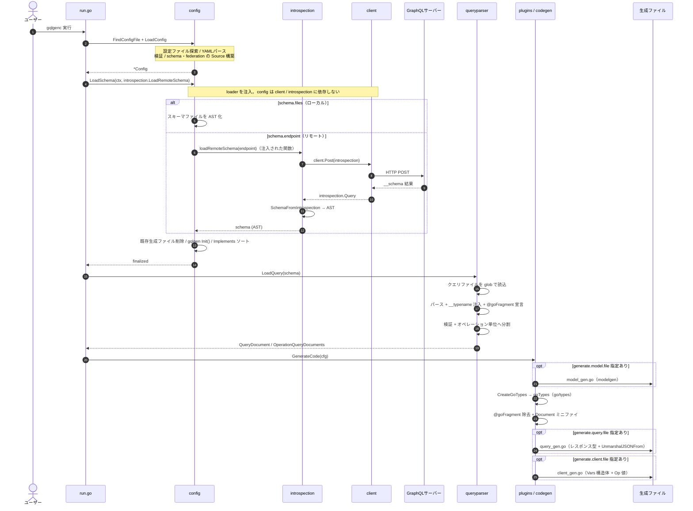
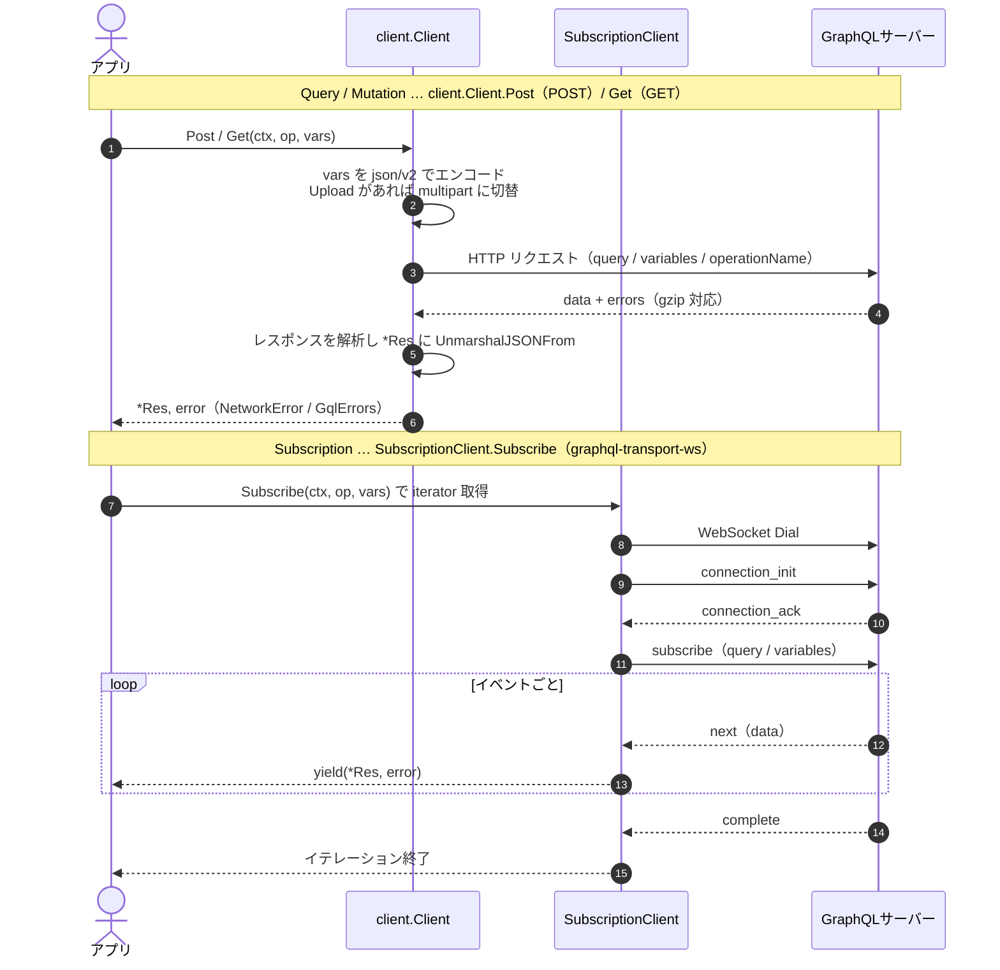

# gqlgenc

[gqlgen](https://github.com/99designs/gqlgen) をベースにした、Go 用 GraphQL クライアントのコードジェネレータおよびランタイムライブラリ。

## 概要

gqlgenc は、GraphQL スキーマとクエリ（オペレーション）から型安全な Go のクライアントコードを自動生成するツールです。コードを起点にする Code First ではなく、クエリを起点にコードを生成する Query First を採用しています。

- gqlgen ベース。モデル生成には gqlgen の modelgen プラグインをそのまま利用し、設定も gqlgen の形式を踏襲します
- 生成コードとランタイムは `encoding/json/v2` / `encoding/json/jsontext` を使用します

## v1 設計方針

- シンプルな生成コード
- シンプルな実装コード
- 最小のConfig、設定より規約
- モダンな言語機能の採用
- **`http.Client` の責務を持たず、ユーザに全権を渡す** — HTTP の操作（ヘッダー・認証・タイムアウト・ロギング・リトライなど）は標準 `net/http`（`http.RoundTripper`）と自前の `Option` に寄せ、GraphQL クライアント自身はオプションヘルパーを一切持たない

## 動作要件

- Go 1.27 以上。Go 1.27 はまだ正式リリースされていないため、現状は開発版ツールチェーン（gotip）が必要です:

```shell
go install golang.org/dl/gotip@latest
gotip download
```

- 環境変数 `GOEXPERIMENT=jsonv2` が必要です（`encoding/json/v2` を使用するため）。**gqlgenc 本体のインストール時だけでなく、生成コードを取り込むあなたのアプリのビルド・テスト時にも**設定してください

## インストール

```shell
GOEXPERIMENT=jsonv2 gotip install github.com/Yamashou/gqlgenc/v3@latest
# go の tool 依存として追加する場合
GOEXPERIMENT=jsonv2 gotip get -tool github.com/Yamashou/gqlgenc/v3@latest
```

> gqlgenc 自身が `encoding/json/v2` を使うため、インストール時にも `GOEXPERIMENT=jsonv2` が必要です。Go 1.27 が正式リリースされたら `gotip` を `go` に置き換えられます。

## 使い方

### 1. 設定ファイルを書く

カレントディレクトリ（見つからない場合は親ディレクトリを順に遡る）の `.gqlgenc.yml` / `gqlgenc.yml` / `.gqlgenc.yaml` / `gqlgenc.yaml` を読み込みます。

ローカルのスキーマファイルから生成する例:

```yaml
schema:
  files:
    - ./schema/*.graphql
query:
  files:
    - ./query/*.graphql
bind:
  type:
    named:
      Email:
        model: github.com/example/myapp/domain.Email
generate:
  model:
    file: ./domain/model_gen.go
  query:
    file: ./domain/query_gen.go
  client:
    file: ./query/client_gen.go
```

リモートサーバーからイントロスペクションでスキーマを取得する場合は、`schema.files` の代わりに `schema.endpoint` を指定します。

```yaml
schema:
  endpoint:
    url: https://api.example.com/graphql
    headers:
      Authorization: "Bearer ${TOKEN}" # 環境変数を展開できる
query:
  files:
    - ./query/*.graphql
generate:
  model:
    file: ./gen/model_gen.go
  query:
    file: ./gen/query_gen.go
  client:
    file: ./gen/client_gen.go
```

> **注意（introspection の制限）:** `schema.endpoint` での introspection は、型の list / non-null 入れ子が introspection クエリの `ofType` 深さ（7）を超えると取得できずエラーになります（例: 深くネストしたリスト型）。その場合は `schema.files` でローカルスキーマを指定してください。

### 2. コードを生成する

設定ファイルのあるディレクトリで実行します。

```shell
gqlgenc
```

### 3. 生成されたクライアントを使う

```go
package main

import (
	"context"
	"errors"
	"fmt"

	"github.com/Yamashou/gqlgenc/v3/client"

	"github.com/vektah/gqlparser/v2/gqlerror"

	"github.com/example/myapp/query"
)

func main() {
	ctx := context.Background()

	c := client.NewClient("https://api.example.com/graphql")

	res, err := c.Post(ctx, query.GetUserOp, query.GetUserVars{ID: "user-1"})
	if err != nil {
		// HTTP ステータス異常・GraphQL エラーは errors.As で型別に取り出せる
		var httpErr *client.HTTPError
		if errors.As(err, &httpErr) {
			fmt.Println("http status:", httpErr.Code)
		}
		var gqlErrs gqlerror.List
		if errors.As(err, &gqlErrs) {
			fmt.Println("graphql errors:", gqlErrs)
		}
		// GraphQL エラー時も res に部分データが入っていることがある
	}
	_ = res
}
```

動作する完全なサンプルは `testdata/integration/basic/` と `run_test.go` を参照してください。

## 設定仕様

設定ファイルは YAML 形式で、読み込み時に `os.ExpandEnv` によって環境変数（`${VAR}` / `$VAR`）が展開されます。未知のキーがあるとエラーになります。json/v2 タグや Omittable など v3 が常に必要とする gqlgen 側の設定は内部で固定しており、ユーザーが指定する項目はクライアント生成に必要なものだけに絞っています。

設定は `schema`（ソース＋スキーマ設定）/ `query`（クエリソース）/ `bind`（GraphQL → Go 型の解決）/ `generate`（出力ファイル）の4セクションです。生成ファイルの package は各 `file` のディレクトリ名から導出されます。

```yaml
# ── スキーマ（ソース＋スキーマ設定） ──
schema:
  # []string（glob 可、** 対応）ローカルスキーマファイル。endpoint と排他
  files:
    - ./schema/*.graphql

  # url / headers イントロスペクションでスキーマを取得するエンドポイント。files と排他
  endpoint:
    url: https://api.example.com/graphql
    headers:
      Authorization: "Bearer ${TOKEN}"

  # int（デフォルト: 0 = 無効）Apollo Federation ディレクティブを含むスキーマへの対応
  federation:
    version: 2

# ── クエリ（ソース） ──
query:
  # []string（必須、glob 可）クエリファイルのパス
  files:
    - ./query/*.graphql

# ── バインド（GraphQL → Go 型の解決。モデル・クエリ両方の生成に効く） ──
bind:
  # スキーマの型へのバインド
  type:
    # []string 同名の Go 型が指定パッケージにあれば自動バインド（gqlgen の autobind 相当）
    packages:
      - github.com/example/myapp/domain
    # マップ GraphQL 型名 → Go 型 の明示バインド
    named:
      Email:
        model: github.com/example/myapp/domain.Email
  # フラグメントへのバインド
  fragment:
    # []string フラグメント名と同名の Go 型が指定パッケージにあれば、レスポンス型を生成せずバインド
    # （@goFragment のパッケージ指定版）。bind.type.packages とは独立
    packages:
      - github.com/example/myapp/domain

# ── 生成（出力ファイル。package は各 file のディレクトリ名から導出） ──
generate:
  # input 型・enum 型の model_gen.go。file を省略するとモデル生成をスキップ
  # （サーバー側 gqlgen で生成したモデルを bind.type.packages で共有する場合）
  model:
    file: ./gen/models_gen.go
  # レスポンス型・UnmarshalJSON・クエリドキュメント定数
  query:
    file: ./gen/query_gen.go
    # bool（デフォルト: false）生成型に nil セーフな getter メソッド（Get<フィールド>()）を生成する。
    # query_gen.go に生成される全型（レスポンス型・生成フラグメント型）に一律で適用される
    getters: false
  # 型付き variables 構造体と client.Operation 値。指定する場合は generate.query.file も必須
  client:
    file: ./gen/client_gen.go
```

### バリデーションルール

- `schema.files` と `schema.endpoint` はどちらか一方を必ず指定する（両方指定・両方未指定はエラー）
- `query.files` は必須
- `generate.query.file` と `generate.model.file` の少なくとも一方の指定が必須（どちらも無いと生成するものがないためエラー）
- `generate.client.file` を指定する場合は `generate.query.file` の指定が必須
- クエリ全体でオペレーション名が重複しているとエラー

## 生成されるコード

生成実行時、既存の生成ファイル（model / querygen / clientgen）は事前に削除されます。生成後は goimports で整形されます。

### model_gen.go（modelgen）

`generate.model.file` を指定すると、gqlgen 標準の modelgen プラグインを使い、MutateHook で **クエリで使われている Input 型と Enum 型だけ** を生成します。Object / Interface / Union 型は生成しません。

- レスポンスの形は query_gen.go の専用型が表現し、再利用したい応答型は `@goFragment` / autobind で既存 Go 型にバインドするため、スキーマの Object 型モデルはクライアントから参照されない
- 使用判定は、変数定義の Input 型（ネストした Input を再帰的に辿る）と、セレクションセットで参照される Enum 型から行う

`generate.model.file` の指定有無で使い方が分かれます。

| 観点 | `generate.model.file` を指定 | `generate.model.file` を省略 |
| --- | --- | --- |
| gqlgenc の model 生成 | する（modelgen が動く） | しない |
| 生成される型 | クエリで使う **Input 型・Enum 型のみ** | なし |
| Object / Interface / Union | 生成しない | 生成しない |
| モデルの入手元 | gqlgenc が生成したものを使う | `bind.type.packages` で既存モデル（server 側 gqlgen 生成 など）を参照 |
| 主な用途 | client と server で model を**共有しない** | client と server で model を**共有する** |

enum には gqlgen が `MarshalJSON` / `UnmarshalJSON` を生成するため（[gqlgen#3663](https://github.com/99designs/gqlgen/pull/3663)）、json.Marshal でそのままシリアライズできます。

生成された enum の `UnmarshalJSON` は `IsValid()` で未知の値を拒否します。そのため、**コード生成後にサーバー側スキーマへ enum 値が追加されると、その値を含むレスポンス全体がデコードエラーになります**（未知 enum を素通しする前方互換動作ではありません）。サーバーが enum 値を増やしたら、クライアントを再生成してください。これは強い型安全と引き換えの挙動です。

### query_gen.go（querygen）

オペレーションごとに以下を生成します。

- レスポンス型: セレクションセットの構造に対応したネスト構造体。各フィールドに json タグが付く。`generate.query.getters: true` を指定した場合のみ、各フィールドに nil レシーバ安全な getter メソッドも生成する（デフォルトは生成せず、フィールドへ直接アクセスする）。getter は query_gen.go に生成される全型（オペレーション応答型・生成フラグメント型）に一律で適用される
- フラグメント対応:
  - フラグメントスプレッドは `json:"-"` 付きの名前付きフィールド（型名と同名）として表現し、UnmarshalJSONFrom 内で同じ JSON データから直接デコードする。**埋め込みフィールドにはしない**（理由は後述の「フラグメントスプレッドを埋め込まない理由」）。アクセスは常に `t.<フラグメント名>.<フィールド>`
  - インラインフラグメント（`... on Type`）は `__typename` の値を見て対応するフィールドにデコードする。`__typename` がクエリに無くても、インラインフラグメントを含む選択セットには生成時に `__typename` を自動で追加するため、interface / union のデコードが常に動作する
  - フラグメント定義やフィールド選択に `@goFragment(type: "import/path.Type")` を付けると、型を生成せず指定した既存 Go 型にバインドする（`fragment X on T @goFragment(type: "...") { ... }`）。バインド型のデコードは json/v2 のデフォルト（または型自身の `UnmarshalJSON`）に任せる。`@goFragment` はクライアント側のコード生成専用で、サーバーへ送るクエリからは除去される
  - `bind.fragment.packages` にパッケージを列挙すると、フラグメント名と同名の Go 型がそのパッケージにある場合、`@goFragment` を書かなくても自動でその既存型にバインドする（`bind.type.packages` のクエリ版。マッチ対象はフラグメント名）。明示的な `@goFragment(type: ...)` が付いている場合はそちらが優先される
- `UnmarshalJSONFrom`（json/v2 の `UnmarshalerFrom`）はフラグメントを含む型にのみ生成される。通常フィールドはメソッドを持たない別名型（`type plain T`）を経由して json/v2 のデフォルトデコードに任せ、フラグメントスプレッドと `__typename` 分岐だけを追加でデコードする。フラグメントを含まない型はメソッド自体を生成せず、デフォルトデコードで処理される
- クエリドキュメント定数（`<オペレーション名>Document`）
- `@skip(if:)` / `@include(if:)` の付いたフィールドは、スキーマが非 null でもポインタ（nullable）で生成する。これらは条件によってレスポンスから欠落し得るため、欠落を `nil` で表現できるようにするため。`@skip` / `@include` 自体はサーバーへ送るクエリにそのまま保持される

### フラグメントスプレッドを埋め込まない理由

フラグメントスプレッドは **埋め込みフィールドではなく名前付きフィールド**（`<フラグメント名> <フラグメント型> json:"-"`）として生成します。

```go
type OptionalProfile struct {
	PublicProfileFields  PublicProfileFields  `json:"-"` // { id, status }
	PrivateProfileFields PrivateProfileFields `json:"-"` // { id, age }
}
```

埋め込みにすると Go のフィールド昇格が働き、**複数のフラグメントが同名フィールドを持つと曖昧（ambiguous selector）になりコンパイルエラー**になります。上の例で `PublicProfileFields` と `PrivateProfileFields` がどちらも `id` を持つ場合、埋め込みでは Go の規則「最も浅い深さに一意なフィールドが無ければ不正」により `op.id` がコンパイルエラーになります（`Status` / `Age` のように片方にしか無いフィールドは一意なので昇格でき、`op.Status` は通ります）。また直接選択したフィールドと同名のフラグメントフィールドは、直フィールドが shadow して勝つため由来が非自明になります。

これらを避けるため埋め込まず、アクセスは常に `t.<フラグメント名>.<フィールド>`（例: `op.PublicProfileFields.ID`）に統一しています。名前付きでも、デコードは `UnmarshalJSONFrom` 内で各フラグメントを同じ JSON データから個別に展開するため値は正しく入ります（埋め込みの「昇格による短縮アクセス」だけを手放し、デコードの正しさは保たれます）。

### omitzero タグの付与（input / model / query）

`omitzero` json タグは、`model_gen.go`（gqlgen modelgen）の **nullable フィールド**に付与されます（input 型・object 型の両方。gqlgenc が内部で常に有効化しています）。`omitzero` はマーシャル（送信）時にしか効かないため、デコード専用の `query_gen.go` のレスポンス型には付与しません。

| 対象 | `omitzero` | 理由 |
|---|---|---|
| **input model**（`model_gen.go` の input 型の nullable フィールド） | 付く | variables として送信されるため意味がある（未設定なら省略 = undefined） |
| **model**（`model_gen.go` の object/出力型の nullable フィールド） | 付く | gqlgen 標準の挙動。クライアントはレスポンスを query のレスポンス型へデコードするため、出力モデル自体はマーシャルされず実質的な影響は小さい |
| **query**（`query_gen.go` のレスポンス型） | 付かない | レスポンス型はデコード専用で、`omitzero` はマーシャル時にしか効かないため不要 |

`omitzero` の付与に加え、input の nullable フィールドが `graphql.Omittable[T]` になること（未設定（undefined）/ 明示的な null / 値 を区別できる3状態。後述の「variables の undefined / null / 値の指定」参照）も、いずれも gqlgenc が内部で常に有効化しているため設定は不要です。

### client_gen.go（clientgen）

オペレーションごとに型付き variables 構造体（`<オペレーション名>Vars`）と `client.Operation` 値（`<オペレーション名>Op`）を生成します。実行は `Post` メソッドで行い、変数名や型のミスはコンパイルエラーになります。

```go
type UserOperationVars struct {
	ArticleID string                  `json:"articleId"`
	Size      graphql.Omittable[*int] `json:"size,omitzero"`
}

var UserOperationOp = client.Operation[UserOperationVars, domain.UserOperation]{
	Name:     "UserOperation",
	Document: domain.UserOperationDocument,
}
```

```go
res, err := c.Post(ctx, query.UserOperationOp, query.UserOperationVars{
	ArticleID: "article-1",
	Size:      graphql.OmittableOf[*int](&size),
})
```

### variables の undefined / null / 値の指定（Omittable）

nullable な input フィールドと nullable なオペレーション変数は、`graphql.Omittable[T]` 型で生成されます（gqlgenc が内部で常に有効化。json タグには `omitzero` が付きます）。これにより、生成時に挙動を固定することなく、**フィールド/変数ごと・呼び出しごとに undefined（省略）/ null / 値を実行時に使い分け**られます。

```go
type UpdateUserInput struct {
	ID       UserID                                `json:"id"`            // 必須 → 常に送信
	Name     graphql.Omittable[*string]            `json:"name,omitzero"` // nullable → 可変
	Settings graphql.Omittable[*UserSettingsInput] `json:"settings,omitzero"`
}
```

```go
name := "Alice"

// 省略（undefined）: JSON に含めない → サーバーはスキーマのデフォルト/未指定として扱う
Name: graphql.Omittable[*string]{},
// 明示的な null: "name":null
Name: graphql.OmittableOf[*string](nil),
// 値: "name":"Alice"
Name: graphql.OmittableOf(&name),
```

各フィールドは独立しているため、「Name は省略・Settings は null・Tags は値」のような組み合わせも自由です。生成時に `omitzero` を固定するトグルは不要で、`graphql.Omittable[T]` により実行時に制御します。

注意:

- 同じ仕組みが **オペレーション変数**にも適用されます。nullable な変数（例 `$size: Int` → `Vars.Size graphql.Omittable[*int]`）も undefined（省略）/ null / 値を区別でき、省略するとスキーマのデフォルト（`$x: Int = 5` やフィールド引数の `= ...`）が適用されます。非 nullable（必須）変数（例 `$id: ID!` → `Vars.ID string`）は素の型で常に送信されます。
- input オブジェクト・変数いずれも、非 nullable（必須）のもの（例 `id: ID!`）は省略できず常に送信されます。

## ランタイム（client パッケージ）

### API

- `client.NewClient(endpoint string, options ...Option) *Client` — query / mutation 用のクライアント（`Post` / `Get`）
- `client.NewSubscriptionClient(endpoint string, options ...Option) *SubscriptionClient` — subscription 用のクライアント（`Subscribe`）。endpoint は WebSocket URL（`ws://` / `wss://`）を直接渡す
- `client.Option`（`func(*http.Client) *http.Client`）— 使用する `http.Client` を返す関数。gqlgenc はヘルパーを一切提供せず、ユーザが自分で書く。`NewClient` / `NewSubscriptionClient` に渡すか、`Post` / `Get` / `Subscribe` に渡すと**その呼び出しだけ**に適用される。`Option` 内で `http.Client` をコピーして返せば、基底クライアントや共有 `http.Client`（`http.DefaultClient` など）を汚さない
- `client.Operation[Kind, Vars, Res]` / `(*Client).Post[Kind, Vars, Res](ctx, op, vars, options...)` — clientgen が生成する Operation 値を型付き variables で実行するジェネリックメソッド（Go 1.27 の generic methods を使用）。`Kind` は `client.Query` / `client.Mutation` / `client.Subscription` のいずれかで、`Post` は query / mutation のみ受け付ける
- `(*Client).Get[Vars, Res](ctx, op, vars, options...)` — query オペレーションを HTTP GET で実行する。variables は URL に JSON エンコードされる。GraphQL 仕様により GET は mutation に使えず、`Kind` の型制約でコンパイル時に防がれる
- `(*SubscriptionClient).Subscribe[Vars, Res](ctx, op, vars, options...) iter.Seq2[*Res, error]` — subscription オペレーションを WebSocket で実行し、結果を逐次返すイテレータを返す

### HTTP のカスタマイズ（ヘッダー・認証）

**設計方針**: gqlgenc は `http.Client` の設定責務を持たず、ユーザに全権を渡します。ヘッダー付与・認証・タイムアウト・ロギング・リトライ・テスト用 transport などは、すべて標準の `net/http`（`http.RoundTripper`）と自前の `Option` で行います。GraphQL クライアント自身は `WithRoundTripper` / `WithHTTPClient` / `WithHTTPHeader` などの**オプションヘルパーを一切提供しません**（v0 の Interceptor も廃止）。`Option` は `func(*http.Client) *http.Client` なので、使用する `http.Client` を自由に組み立てて返せます。

```go
// ヘッダー付与・認証などは自前の http.RoundTripper で行う。RoundTripper は
// リクエストごとに呼ばれるため、ローテーションするトークンや ctx 由来の値にも対応できる
type authTransport struct{ base http.RoundTripper }

func (t authTransport) RoundTrip(req *http.Request) (*http.Response, error) {
    req = req.Clone(req.Context()) // RoundTripper は元のリクエストを変更しない
    req.Header.Set("Authorization", "Bearer "+tokenFrom(req.Context()))
    return t.base.RoundTrip(req)
}

// gqlgenc はヘルパーを提供しないので、transport を包む Option は自分で書く。
// 共有 http.Client を汚さないようコピーしてから transport を差し替える。
withTransport := func(wrap func(http.RoundTripper) http.RoundTripper) client.Option {
    return func(c *http.Client) *http.Client {
        base := c.Transport
        if base == nil {
            base = http.DefaultTransport
        }
        cc := *c
        cc.Transport = wrap(base)
        return &cc
    }
}

c := client.NewClient(endpoint, withTransport(func(base http.RoundTripper) http.RoundTripper {
    return authTransport{base: base}
}))

// 呼び出し単位で付与する場合は Post / Get / Subscribe にオプションとして渡す
c.Post(ctx, op, vars, withTransport(func(base http.RoundTripper) http.RoundTripper {
    return authTransport{base: base}
}))

// 独自の http.Client（タイムアウト等）をまるごと使いたい場合は、それを返す Option を書く
c2 := client.NewClient(endpoint, func(*http.Client) *http.Client {
    return &http.Client{Timeout: 10 * time.Second}
})
```

ヘッダーを付与する `Option` を返すヘルパー（`withHeader`）も、`withTransport` を使って自分で書けます。

```go
// http.RoundTripper を関数リテラルで書くためのアダプタ
type roundTripperFunc func(*http.Request) (*http.Response, error)

func (f roundTripperFunc) RoundTrip(req *http.Request) (*http.Response, error) { return f(req) }

// 任意の HTTP ヘッダーを付与する Option を返すヘルパー
withHeader := func(headers http.Header) client.Option {
    return withTransport(func(base http.RoundTripper) http.RoundTripper {
        return roundTripperFunc(func(req *http.Request) (*http.Response, error) {
            req = req.Clone(req.Context()) // RoundTripper は元のリクエストを変更しない
            for key, values := range headers {
                for _, value := range values {
                    req.Header.Add(key, value)
                }
            }
            return base.RoundTrip(req)
        })
    })
}

// クライアント全体に固定ヘッダーを設定する
c3 := client.NewClient(endpoint, withHeader(http.Header{
    "X-Api-Key":        {"my-api-key"},
    "X-Client-Version": {"1.2.3"},
}))

// 呼び出し単位で付与する場合は Post / Get / Subscribe に渡す
c3.Post(ctx, op, vars, withHeader(http.Header{"X-Request-Id": {requestID}}))
```

v0 系にあった GraphQL リクエスト・レスポンスの Interceptor も、同じく `http.RoundTripper` で実現します。GraphQL リクエストは HTTP ボディの JSON（`{"query": ..., "variables": ..., "operationName": ...}`）、GraphQL レスポンスはレスポンスボディの JSON（`{"data": ..., "errors": ...}`）そのものなので、transport で両方を観察・加工できます。複数の処理を組み合わせたい場合は `withTransport` を重ねて包めば、v0 の Interceptor チェーン相当になります。

```go
// v0 の Interceptor 相当: GraphQL のリクエスト・レスポンス JSON を観察・加工する
type loggingTransport struct{ base http.RoundTripper }

func (t loggingTransport) RoundTrip(req *http.Request) (*http.Response, error) {
    req = req.Clone(req.Context()) // RoundTripper は元のリクエストを変更しない

    // リクエスト側: {"query": ..., "variables": ..., "operationName": ...}
    // Get で実行した場合はボディが無く、クエリは req.URL.RawQuery に載る
    if req.Body != nil {
        body, err := io.ReadAll(req.Body)
        if err != nil {
            return nil, err
        }
        req.Body.Close()
        log.Printf("graphql request: %s", body)
        req.Body = io.NopCloser(bytes.NewReader(body)) // 読んだ分を復元する
    }

    resp, err := t.base.RoundTrip(req)
    if err != nil {
        return nil, err
    }

    // レスポンス側: {"data": ..., "errors": ...}
    body, err := io.ReadAll(resp.Body)
    resp.Body.Close()
    if err != nil {
        return nil, err
    }
    log.Printf("graphql response: %s", body)
    resp.Body = io.NopCloser(bytes.NewReader(body)) // 読んだ分を復元する
    return resp, nil
}

c4 := client.NewClient(endpoint, withTransport(func(base http.RoundTripper) http.RoundTripper {
    return loggingTransport{base: base}
}))
```

v0 の `RequestInterceptor`（`func(ctx, req, gqlInfo, res, next) error`）の各引数との対応は次のとおりです。

- `ctx` / `req` — `req`（と `req.Context()`）をそのまま使う
- `gqlInfo`（パース済みの Query / Variables / OperationName）— transport が見るのはシリアライズ後の JSON ボディ。必要であればボディを `{"query": ..., "variables": ..., "operationName": ...}` としてデコードして参照する
- `res`（デコード済みレスポンス）— デコードは transport の後段で行われるため、型付きの `res` は transport からは見えない。レスポンスを加工したい場合はレスポンスボディの JSON を書き換えれば、その後のデコード結果に反映される
- `ChainInterceptor` — `withTransport` で包んだ Option を `NewClient` に複数渡すことで代替する。後に渡したものが外側（先に実行される側）になる

なお、自分で `Accept-Encoding: gzip` を設定している場合、transport が見るレスポンスボディは圧縮されたままです（gqlgenc が展開するのは transport の後段）。設定していなければ Go の `http.Transport` が透過的に展開するため、そのまま JSON として読めます。

テストでは in-memory transport を返す `Option`（上の `withTransport` 等）で差し替えます。

### リクエスト仕様

- HTTP POST で送信する
- `Content-Type: application/json;charset=utf-8`
- `Accept: application/graphql-response+json;charset=utf-8` と `application/json;charset=utf-8`
- ボディは `{"query": ..., "variables": ..., "operationName": ...}` を json/v2 でエンコードしたもの

GET で実行する場合（`Get` メソッド）は [GraphQL-over-HTTP 仕様](https://graphql.github.io/graphql-over-http/draft/)に従い、`query` / `operationName` / `variables`（JSON 文字列）を URL のクエリ文字列にエンコードします。ボディは持たないため `Content-Type` は付けず、`graphql.Upload` を含む variables は使えません。CDN やプロキシでのキャッシュに有効ですが、大きなクエリ・変数は URL 長制限に注意してください。

### ファイルアップロード

variables に `graphql.Upload`（`github.com/99designs/gqlgen/graphql`）が含まれる場合、`Post` は [graphql-multipart-request-spec](https://github.com/jaydenseric/graphql-multipart-request-spec) に従った multipart/form-data リクエストを自動的に組み立てます。Upload は variables のエンコード中に検出されるため、ネストした input オブジェクトやリストの中にあっても動作します。Upload が含まれない場合は通常の JSON リクエストになります。

リクエストボディは `io.Pipe` でストリーミング送信するため、ファイル本体をメモリに溜め込みません（大きなファイルでもメモリ使用量は一定）。各ファイルパートの `Content-Type` は `Upload.ContentType` を指定していればそれを使い、無ければ `application/octet-stream` になります。

### レスポンス解析とエラー

- `Content-Encoding: gzip` のレスポンスは透過的に展開される
- レスポンスボディを走査して `data` の生 JSON を取り出し、`errors` は `gqlerror.List`（vektah/gqlparser）としてデコードする。`data` は `errors` を読み終えてからレスポンス型へデコードするため、`data` が型と一致しなくても同梱された GraphQL エラーをデコードエラーで握り潰さず、GraphQL エラーを優先して返す
- エラー時は `ErrorResponse` が返り、`errors.As` で `*client.HTTPError`（HTTP ステータス異常）や `gqlerror.List`（GraphQL エラー）を取り出せる
- GraphQL エラー時もデコード済みの部分データが `Post` の戻り値として返る（GraphQL は data と errors の共存を許すため）
- HTTP ステータスが 2xx でも GraphQL レスポンスとしてパースできない場合はエラーになる
- HTTP ステータスが異常（非2xx）のとき、`HTTPError.Message` にはレスポンスボディの先頭 1 KiB だけを埋め込み（巨大・機微なエラーページがエラー文字列やログを汚さないため）、全文は `HTTPError.Body` に保持する
- デコードはレスポンスがスキーマの nullability に従うことを前提とする。スキーマが非 null としていたフィールドをサーバーが `null` で返すと、json/v2 がサイレントにゼロ値（空文字・0 など）へデコードし、`null` と「フィールド欠落」を区別しない。コード生成後にサーバー側スキーマが非 null→null へ変わるスキーマ drift はクライアントでは検知できない
- interface / union のデコードは応答に `__typename` が含まれることを前提とする（クエリには生成時に自動付与する。前述「query_gen.go（querygen）」参照）。サーバーが `__typename` を返さないと、どのインラインフラグメントの枝にもマッチせず、該当フィールドはゼロ値（ポインタなら nil）のままになる（エラーにはならない）

### Subscription

subscription オペレーションは subscription 専用の `SubscriptionClient`（`NewSubscriptionClient` で生成）の `Subscribe` メソッドで実行します。[graphql-transport-ws](https://github.com/enisdenjo/graphql-ws) プロトコルで WebSocket 接続し、結果を `iter.Seq2[*Res, error]` として逐次返します。query / mutation の `Client` とは別の型です。

```go
c := client.NewSubscriptionClient("wss://api.example.com/graphql")

for res, err := range c.Subscribe(ctx, query.OnMessageOp, query.OnMessageVars{RoomID: "1"}) {
	if err != nil {
		// エラー処理
		break
	}
	fmt.Println(res.OnMessage.Body)
}
```

- 接続は呼び出しごとに開かれ、サーバーの `complete`、`error`、WebSocket の正常クローズ（1000 / 1001）、または `ctx` の完了で終了します（`range` を抜けた時点でも接続を閉じます）。`complete` を送らずに正常クローズするサーバーでもエラーにはなりません
- `ctx` がキャンセルされた場合、イテレータはキャンセルエラーを yield せずに終了します
- ハンドシェイク中（`connection_ack` 待ち）にサーバーが `ping` を送ってきても、`pong` で応答して `connection_ack` を待ち続けます
- `query`/`mutation` と同じ `client.Operation` 値（`<オペレーション名>Op`）をそのまま使えます。clientgen は subscription も他のオペレーションと同じく `<オペレーション名>Vars` / `<オペレーション名>Op` を生成します

### 操作種別と型安全

clientgen は各オペレーションの種別（query / mutation / subscription）を `client.Operation` の `Kind` 型パラメータに埋め込みます。これにより、実行メソッドと操作種別の不一致がコンパイルエラーになります。

```go
var UserOperationOp = client.Operation[client.Query, ...]{...}
var UpdateUserOp    = client.Operation[client.Mutation, ...]{...}
var CountOp         = client.Operation[client.Subscription, ...]{...}
```

- `Get` は `client.Query` のみ受け付けます（GET で mutation は GraphQL 仕様違反）
- `Post` は `client.Query` / `client.Mutation` を受け付けます（subscription は不可）
- `Subscribe` は `client.Subscription` のみ受け付けます

### null と undefined の区別

input 型の nullable フィールドは `graphql.Omittable[T]` になり（gqlgenc が内部で常に有効化）、null と undefined を区別して送信できます。

```go
// undefined: キー自体が送信されない
input := UpdateUserInput{
	Name: graphql.Omittable[*string]{},
}

// null: {"name": null} が送信される
input := UpdateUserInput{
	Name: graphql.OmittableOf[*string](nil),
}
```

## アーキテクチャと処理フロー

`gqlgenc` コマンドは次の順に処理します。

1. **設定読み込み**（`config.LoadConfig`）: 設定ファイルの探索、YAML パース（環境変数展開・未知キー検出）、バリデーション
2. **スキーマ読み込み**（`config.LoadSchema`）: `run.go` が `introspection.LoadRemoteSchema` を注入し、`LoadSchema` はローカルファイル、または `endpoint` 指定時に注入された loader でリモートスキーマを取得する。さらに既存の生成ファイルを削除して gqlgen の `Init()` を実行し、interface の実装リストをソートして出力を決定的にする。loader を注入する（直接 import しない）ことで `config` パッケージは `client` に依存しない
3. **クエリ読み込み**（`GQLGencConfig.LoadQuery`）: クエリファイルをパースしてスキーマに対して検証し、オペレーション単位の QueryDocument（参照フラグメント込み）に分割する
4. **コード生成**（`plugins.GenerateCode`）: modelgen → オペレーションと Go 型の構築（codegen）→ querygen → clientgen の順に実行する

### シーケンス図（コード生成）


```mermaid
sequenceDiagram
    autonumber
    actor U as ユーザー
    participant run as run.go
    participant cfg as config
    participant intro as introspection
    participant cl as client
    participant srv as GraphQLサーバー
    participant qp as queryparser
    participant gen as plugins / codegen
    participant out as 生成ファイル

    U->>run: gqlgenc 実行
    run->>cfg: FindConfigFile + LoadConfig
    Note over cfg: 設定ファイル探索 / YAMLパース<br/>検証 / schema・federation の Source 構築
    cfg-->>run: *Config

    run->>cfg: LoadSchema(ctx, introspection.LoadRemoteSchema)
    Note over cfg,cl: loader を注入。config は client / introspection に依存しない
    alt schema.files（ローカル）
        cfg->>cfg: スキーマファイルを AST 化
    else schema.endpoint（リモート）
        cfg->>intro: loadRemoteSchema(endpoint)（注入された関数）
        intro->>cl: client.Post(introspection)
        cl->>srv: HTTP POST
        srv-->>cl: __schema 結果
        cl-->>intro: introspection.Query
        intro->>intro: SchemaFromIntrospection → AST
        intro-->>cfg: schema (AST)
    end
    cfg->>cfg: 既存生成ファイル削除 / gqlgen Init() / Implements ソート
    cfg-->>run: finalized

    run->>qp: LoadQuery(schema)
    qp->>qp: クエリファイルを glob で読込
    qp->>qp: パース + __typename 注入 + @goFragment 宣言
    qp->>qp: 検証 + オペレーション単位へ分割
    qp-->>run: QueryDocument / OperationQueryDocuments

    run->>gen: GenerateCode(cfg)
    opt generate.model.file 指定あり
        gen->>out: model_gen.go（modelgen）
    end
    gen->>gen: CreateGoTypes → goTypes（go/types）
    gen->>gen: @goFragment 除去 + Document ミニファイ
    opt generate.query.file 指定あり
        gen->>out: query_gen.go（レスポンス型 + UnmarshalJSONFrom）
    end
    opt generate.client.file 指定あり
        gen->>out: client_gen.go（Vars 構造体 + Op 値）
    end
```

### シーケンス図（ランタイム）


```mermaid
sequenceDiagram
    autonumber
    actor App as アプリ
    participant C as client.Client
    participant SC as SubscriptionClient
    participant S as GraphQLサーバー

    Note over App,S: Query / Mutation … client.Client.Post（POST）/ Get（GET）
    App->>C: Post / Get(ctx, op, vars)
    C->>C: vars を json/v2 でエンコード<br/>Upload があれば multipart に切替
    C->>S: HTTP リクエスト（query / variables / operationName）
    S-->>C: data + errors（gzip 対応）
    C->>C: レスポンスを解析し *Res に UnmarshalJSONFrom
    C-->>App: *Res, error（NetworkError / GqlErrors）

    Note over App,S: Subscription … SubscriptionClient.Subscribe（graphql-transport-ws）
    App->>SC: Subscribe(ctx, op, vars) で iterator 取得
    SC->>S: WebSocket Dial
    SC->>S: connection_init
    S-->>SC: connection_ack
    SC->>S: subscribe（query / variables）
    loop イベントごと
        S-->>SC: next（data）
        SC-->>App: yield(*Res, error)
    end
    S-->>SC: complete
    SC-->>App: イテレーション終了
```

### パッケージ構成

| パッケージ | 役割 |
|---|---|
| `main` / `run.go` | エントリポイント。上記フローの実行。リモート取得の loader（`introspection.LoadRemoteSchema`）を `LoadSchema` に注入する |
| `config` | 設定ファイルの読み込み・検証、スキーマ読み込み（local / 注入された loader によるリモート取得）と finalize（gqlgen `Init` / Implements ソート）。`client` に依存しない |
| `introspection` | イントロスペクション結果から GraphQL スキーマ（AST）を構築。リモート取得（`LoadRemoteSchema`、`client` 再利用）も担う |
| `queryparser` | クエリのパース・検証、オペレーション分割、使用型の収集 |
| `codegen` | オペレーションと Go 型（go/types）の構築 |
| `plugins/modelgen` | gqlgen modelgen のラップ（未使用型のフィルタリング） |
| `plugins/querygen` | レスポンス型・UnmarshalJSON・ドキュメント定数の生成 |
| `plugins/clientgen` | 型付き Operation 値の生成 |
| `client` | ランタイムの HTTP クライアント |

## 開発

```shell
make build # go build ./...
make test  # go test ./...
make lint  # golangci-lint run
make fmt   # golangci-lint fmt
```

Makefile が `GOEXPERIMENT=jsonv2` をエクスポートします。

## genqlient との比較

[Khan/genqlient](https://github.com/Khan/genqlient) は gqlgenc と同じく Query First を採用した型安全な Go GraphQL クライアントジェネレータです。クエリをスキーマに対して検証して型付きのレスポンス型を生成する点、GraphQL エラーと HTTP エラーを `errors.As` で判別できる点、GraphQL エラー時にも部分データを返す点など、基本的な設計は共通しています。

主な違いは次のとおりです。

| 観点 | gqlgenc（このブランチ） | genqlient |
|---|---|---|
| 基盤 | [gqlgen](https://github.com/99designs/gqlgen) ベース。modelgen・`graphql.Omittable`・Federation 対応をそのまま利用できる | 独自実装（gqlgen 非依存） |
| スキーマの取得 | ローカル SDL またはイントロスペクション（`schema.endpoint`） | ローカル SDL のみ（イントロスペクションによる取得は[未対応](https://github.com/Khan/genqlient/issues/4)） |
| JSON 処理 | `encoding/json/v2`（Go 1.27 以上 + `GOEXPERIMENT=jsonv2`） | `encoding/json`（v1） |
| 実行 API | 型付き variables 構造体と `client.Operation[Kind, Vars, Res]` 値を生成し、ジェネリックな `Post` / `Get` / `Subscribe` メソッドで実行する。全オペレーション横断のミドルウェアを `client.Operation` を受けるジェネリック関数として書ける | オペレーションごとに Go 関数（例: `GetUser(ctx, client, ...) (*getUserResponse, error)`）を生成し、variables は関数引数として渡す |
| interface / union | Go interface を生成しない。インラインフラグメントを型条件名のポインタフィールド（無名構造体）として生成し、レスポンスの `__typename` でデコードする（`__typename` はクエリに無くても自動注入する） | GraphQL interface に対応する Go interface と具象型ごとの実装を生成し、共有フィールドには getter でアクセスする |
| フラグメント | 常に公開の独立型として生成し、名前付きフィールド（`json:"-"`）として保持する（埋め込みによる曖昧昇格を避けるため。`t.<フラグメント名>.<フィールド>` でアクセス） | フラグメントごとに型を生成して埋め込む。`flatten` ディレクティブで中間型を省略できる |
| null / undefined の区別 | gqlgen の `graphql.Omittable[T]` と json/v2 の `omitzero` | `optional: value / pointer / generic` 設定と `@genqlient(pointer: true, omitempty: true)` ディレクティブ |
| 生成のカスタマイズ | 設定より規約。オプションは最小限で、型のバインドは `bind`（type / package）/ `@goField` を利用する | `@genqlient` コメントディレクティブ（`pointer` / `alias` / `typename` / `flatten` / `struct` / `bind` / `for` など）と YAML オプション（`casing` / `context_type` / `client_getter` など）で細かく制御できる |
| カスタムスカラー | `bind.type` バインド | `bindings` / `package_bindings` |
| ファイルアップロード | `graphql.Upload` を含む variables を自動で multipart リクエストにする（[graphql-multipart-request-spec](https://github.com/jaydenseric/graphql-multipart-request-spec)） | 非対応 |
| 操作種別の型安全 | オペレーションの種別（query / mutation / subscription）を `client.Operation` の `Kind` 型パラメータに埋め込み、`Get` は query のみ・`Post` は query / mutation・`Subscribe` は subscription のみをコンパイル時に強制する（GET で mutation を実行できないという GraphQL 仕様違反を型で防ぐ） | 操作種別による実行メソッドの区別はない。GET は `NewClientUsingGet` でクライアント単位に適用し、種別のコンパイル時チェックはない |
| subscription | WebSocket（`graphql-transport-ws`）で対応。`Subscribe` メソッドが `iter.Seq2[*Res, error]` を返す | WebSocket（`graphql-transport-ws` ほか）で対応 |
| HTTP | POST（`Post`）と GET（`Get`、query のみ）。`Accept` ヘッダーで `application/graphql-response+json` をネゴシエーションし、gzip レスポンスを透過的に展開する | POST と GET（`NewClientUsingGet`）。`application/json` のみ |

### gqlgenc の強み

- **gqlgen サーバーとの統合**: サーバーを gqlgen で実装しているなら、モデル・スキーマ・`graphql.Omittable`・カスタムスカラーのバインドをサーバーとクライアントで共有できる。型を二重に定義する必要がなく、`autobind` でサーバー側の Go 型をそのまま使える
- **スキーマ取得の柔軟性**: ローカル SDL に加えてイントロスペクションでのスキーマ取得に対応する（genqlient はローカル SDL のみ）
- **ファイルアップロード**: `graphql.Upload` を含む variables を自動で multipart 化する。ネストした input やリスト内の Upload も検出する（genqlient は非対応）
- **操作種別の型安全**: `Get` / `Post` / `Subscribe` と操作種別の不一致をコンパイル時に検出する
- **性能**: json/v2 のストリーミングデコードで、レスポンスを中間バッファや汎用リフレクションデコーダなしに型へ展開する

### gqlgenc の弱み

- **最先端の Go 機能への依存**: Go 1.27 と `GOEXPERIMENT=jsonv2`（json/v2 は experiment であり Go 1 互換保証の対象外）、generic methods を前提とする。安定版の Go で動かす必要があるプロダクション環境では採用ハードルが高い。genqlient は安定版の Go と `encoding/json`（v1）で動く
- **成熟度**: gqlgenc のこのブランチは pre-release（`v1.0.0-alpha1`）。genqlient は広く使われ安定している
- **生成コードの制御の細かさ**: gqlgenc は「設定より規約」で、生成コードの形を細かく制御する手段は `bind`（type / package）/ `@goField` に限られる。genqlient は `@genqlient` ディレクティブ（`pointer` / `alias` / `flatten` / `struct` / `bind` / `for` / `typename`）でフィールド単位に nullability や中間型の省略などを制御できる
- **gqlgen への依存**: サーバーが gqlgen でない（別言語・別フレームワークの）プロジェクトでは、gqlgen の設定形式・概念を理解する必要があり、依存が純粋なオーバーヘッドになる。genqlient は gqlgen 非依存で単体完結する
- **interface の扱い**: genqlient は GraphQL interface に対応する Go interface と getter を生成し、共通フィールドを型スイッチなしで汎用的に読める。gqlgenc のレスポンス型はラッパー構造体方式で、ケースによっては `__typename` による分岐が必要

### 選択の指針

- **gqlgenc が向くケース**: サーバーを gqlgen で実装していて型定義を共有したい / 最新の Go を使える / イントロスペクションやファイルアップロードが必要
- **genqlient が向くケース**: 安定版の Go で動かす必要がある / サーバーが gqlgen ではない / 生成コードをディレクティブで細かく制御したい / 実績のある安定したツールを使いたい

### genqlient の設定・ディレクティブとの対応

genqlient の設定オプションや `@genqlient` ディレクティブを、gqlgenc でどう実現するかの対応表です。gqlgenc は「設定より規約」のため、genqlient のクエリ単位の細かい制御には同等の手段がないものもあります。

#### 全体設定（genqlient.yaml ↔ .gqlgenc.yml）

| genqlient | 役割 | gqlgenc での実現 |
|---|---|---|
| `schema` | スキーマファイル | `schema.files`（ローカル SDL）/ `schema.endpoint`（イントロスペクション） |
| `operations` | クエリファイル | `query.files` |
| `generated` / `package` | 生成先・パッケージ名 | `generate.query.file` + `generate.client.file`（レスポンス型とクライアントで分割）。package はファイルのディレクトリ名から導出 |
| `bindings`（型→Go 型） | スカラー/型を Go 型にバインド | `bind.type.named`（`型名: { model: ... }`） |
| `package_bindings` | パッケージ内の同名型を一括バインド | クエリのフラグメントは `bind.fragment.packages`、サーバーモデルは `bind.type.packages`（いずれもパッケージのリスト） |
| `bindings.marshaler` / `unmarshaler` | スカラーの変換関数を指定 | バインド先の Go 型に `MarshalJSON` / `UnmarshalJSON` を実装する |
| `optional: pointer` | nullable を `*T` にする | レスポンスの nullable フィールドは既定で `*T`（設定不要） |
| `optional: generic` | undefined / null / 値 の区別 | input は `graphql.Omittable[T]`（gqlgenc が内部で常に有効化） |
| `optional: value`（既定） | nullable をゼロ値で扱う | 非対応（gqlgenc は nullable を `*T` にする） |
| `use_struct_references` | ネスト構造体をポインタに | 非対応（gqlgenc は内部で `struct_fields_always_pointers` を `false` に固定） |
| `casing`（enum 値の命名） | enum 値の Go 名の大小変換 | gqlgen modelgen が処理（個別設定なし） |
| `context_type` | `ctx` 引数の型を差し替え | 非対応（`context.Context` 固定） |
| `client_getter` | クライアント取得関数を差し込む | 非対応（`Post` / `Get` / `Subscribe` にクライアントを明示的に渡す設計） |

#### フィールド単位の制御（@genqlient ディレクティブ ↔ gqlgenc）

| genqlient ディレクティブ | 役割 | gqlgenc での実現 |
|---|---|---|
| `pointer: true` | フィールドを `*T`（nullable）に | スキーマ側 `@goField(omittable: true)` / `bind.type` の型指定。クエリ単位の指定は不可（スキーマ駆動） |
| `omitempty: true` | json タグに omitempty | json/v2 の `omitzero`（gqlgenc が model の nullable フィールドに常に付与） |
| `bind: "..."` | フィールド/フラグメントを特定 Go 型にバインド | スキーマ側は `@goField(type: "...")`、クエリ側はフラグメント定義/フィールドに `@goFragment(type: "...")` |
| `alias: ...` | レスポンス型のフィールド名変更 | クエリで GraphQL の alias を使う（`foo: bar`） |
| `flatten` | フラグメントの中間型を省略して埋め込み | フラグメントスプレッドは名前付きフィールドとして生成（`t.<フラグメント名>.<フィールド>` でアクセス）|
| `struct: true` | 名前付き型でなく無名構造体を生成 | 非対応（生成方式は規約で固定） |
| `typename: "..."` | 生成型の Go 名を指定 | 非対応（レスポンス型は常に公開で自動命名。型名を自分で決めたい部分は Fragment として定義する） |
| `for: "Type.field"` | 型・フィールドを名指しで指定 | 非対応。スキーマの `@goField` で対象を指定する |

設計思想の違いがそのまま出ており、genqlient はクエリコメントの `@genqlient` ディレクティブでフィールド単位に生成コードの形を制御できるのに対し、gqlgenc はスキーマの `@goField` ディレクティブと `bind`（type / package）設定でスキーマ駆動に制御します。スカラー/型バインドと null/undefined の区別はほぼ1:1で対応しますが、`struct` / `typename` / `for` のようなクエリ単位の細かい制御には対応しません。

### 生成コードの比較

同じクエリ `query GetUser($id: ID!) { user(id: $id) { name email } }` に対する、両者の生成コードの違いです。

genqlient はオペレーションごとにトップレベル関数を生成し、variables を関数引数で受け取ります。

```go
// 内部用の variables 構造体（非公開）
type __GetUserInput struct {
	Id string `json:"id"`
}

// レスポンス型: パスを連結した命名（GetUser + User）
type GetUserUser struct {
	Name  string `json:"name"`
	Email string `json:"email"`
}

func (v *GetUserUser) GetName() string  { return v.Name }
func (v *GetUserUser) GetEmail() string { return v.Email }

type GetUserResponse struct {
	User GetUserUser `json:"user"`
}

func (v *GetUserResponse) GetUser() GetUserUser { return v.User }

// オペレーションごとのトップレベル関数。クエリ文字列は関数内に埋め込み
func GetUser(ctx context.Context, client graphql.Client, id string) (*GetUserResponse, error) {
	req := &graphql.Request{
		OpName:    "GetUser",
		Query:     `query GetUser ($id: ID!) { user(id: $id) { name email } }`,
		Variables: &__GetUserInput{Id: id},
	}
	var data GetUserResponse
	resp := &graphql.Response{Data: &data}
	err := client.MakeRequest(ctx, req, resp)

	return &data, err
}
```

gqlgenc は公開の `Vars` 構造体と `Operation` 値を生成し、共通のジェネリックメソッドで実行します。

```go
// client_gen.go: 公開の Vars 構造体 + Operation 値（種別マーカー付き）
type GetUserVars struct {
	ID string `json:"id"`
}

var GetUserOp = client.Operation[client.Query, GetUserVars, domain.GetUser]{
	Name:     "GetUser",
	Document: domain.GetUserDocument,
}
```

```go
// query_gen.go: クエリ文字列は定数、レスポンス型はアンダースコア区切りの命名
const GetUserDocument = `query GetUser ($id: ID!) { user(id: $id) { name email } }`

type GetUser_User struct {
	Name  string `json:"name,omitzero"`
	Email string `json:"email,omitzero"`
}

// getter は nil セーフ
func (t *GetUser_User) GetName() string {
	if t == nil {
		t = &GetUser_User{}
	}
	return t.Name
}

type GetUser struct {
	User *GetUser_User `json:"user"`
}
```

```go
// 実行: Operation 値とジェネリックメソッド。variables は型付き構造体を直接渡す
res, err := c.Post(ctx, query.GetUserOp, query.GetUserVars{ID: "1"})
```

主な構造的な違いは次のとおりです。

| 観点 | genqlient | gqlgenc |
|---|---|---|
| エントリポイント | オペレーションごとのトップレベル関数 `GetUser(ctx, client, id)` | `<オペレーション名>Op` 値 + 共通のジェネリックメソッド `Post` / `Get` / `Subscribe` |
| variables | 非公開 `__GetUserInput` + 関数引数で渡す | 公開 `<オペレーション名>Vars` 構造体を直接渡す |
| クエリ文字列 | 関数内に埋め込み | `<オペレーション名>Document` 定数 |
| レスポンス型の命名 | パス連結（`GetUserUser`）。常に公開 | アンダースコア区切り（`GetUser_User`）。常に公開 |
| getter | プレーン（`return v.X`）。常に生成 | nil セーフ（`if t == nil { … }`）。`generate.query.getters: true` のときのみ生成（デフォルトは生成せず直接フィールドアクセス） |
| デコード | `encoding/json`（v1）+ リフレクション | json/v2。フラグメント型は生成された `UnmarshalJSONFrom`、それ以外は既定デコード |
| クライアント | `graphql.Client` インターフェース（`MakeRequest`）。モックしやすい | 具象 `*client.Client` をジェネリックメソッドに渡す（Transport 差し替えでテスト） |
| 操作種別 | 関数名と返り値で表現（型制約なし） | `Operation` の `Kind` 型パラメータでコンパイル時に制約 |

genqlient は「呼べばよい関数」が並ぶため発見しやすく、`graphql.Client` インターフェースで素直にモックできます。gqlgenc は `Operation` 値とジェネリックメソッドにより、操作種別の型安全・全オペレーション横断のミドルウェア・json/v2 による高速なデコードに寄せた設計です。getter は既定で生成せず、必要な場合だけ `generate.query.getters: true` で nil セーフな getter を生成します（gqlgenc は getter を interface 満足には使わないため、既定ではフィールド直接アクセスで十分）。
